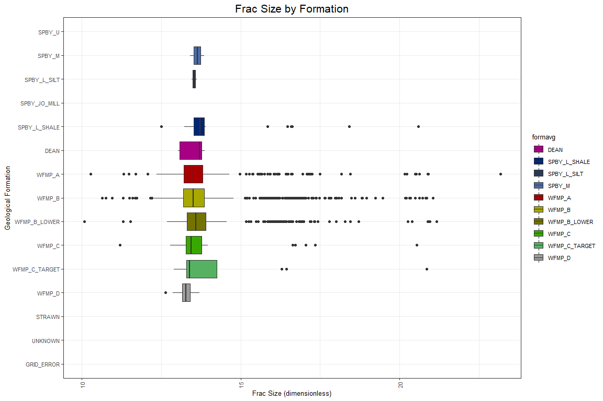

<!-- ```{r code = readLines('Setup.R'), message=FALSE, warning=FALSE} -->
<!-- ``` -->


## Executive Summary

FTNF Analytics is a boutique firm specializing in statistics and data analysis for the energy sector.  The FTNF team includes experts in geology, data visualization, statistics, and predictive modeling.  Our practice services producers globally with a special emphasis on those operating in the Southwest United States.

The Consortium of Texas Oil Producers (CTOP), has engaged FTNF to develop a study to better understand the potential for production in designated areas and help decide the best way to allocate their valuable resources.  Specifically, CTOP needs a way to predict potential energy production (and revenues generated).

FTNF is the ideal partner for this undertaking.  Our process includes enriching existing CTOP data to improve the ability to predict production outcomes.  We start with exploring the data, creating new data, and augmenting the data.  Once satisfied, we proceed to analyzing the data using contemporary statistical methods.  From there, we build predictive models to provide insight necessary to make drilling decisions.

CTOP companies no longer have to rely on hope as a strategy for finding productive wells.  With the help of FTNF Analytics, you can rely on sound science and quantifiable predictions.


## Frac Focus Data Source

The Hydraulic Fracturing Disclosure and Education websites found [here](http://fracfocusdata.org) are being hosted by the Ground Water Protection Council (GWPC) and the Interstate Oil and Gas Compact Commission (IOGCC).  This website provides a central location for public and industry to communicate and relay information on the chemicals used during the process of hydraulic fracturing of oil or gas wells.  The FracFocus website provides impartial and balanced education tools to the public on the topic of hydraulic fracturing.

The GWPC and IOGCC are uniquely suited to host these websites due to their impartial nature and ties to the regulated and regulatory community. This website provides a means for industry to voluntarily supply hydraulic fracturng chemical data in a consistent and centralized location.  This open process assists both public and industry by supplying a centralized repository for the data and removing similar fragmented efforts from around the web. 

These websites provide the following:
A means to Search for voluntarily submitted chemical records by State/County, Operator and Well.
An Education and Informative site for the public and industry on Hydraulic Fracturing Chemicals and the processes used in Hydraulic Fracturing of wells.

The data related to chemicals used to enrich the data on wells comes from the chemical registry website FracFocus.com.  The FracFocus website and data is maintained by two organizations:  Interstate Oil and Gas Compact Commission and the Ground Water Protection Council.

The site maintains data on over 127,000 wells and includes not only data about which chemicals are used, but also data about groundwater protection. FracFocus has instituted a Help Desk to address any issues you may have in using the system. You can reach the Help Desk Monday-Thursday from 8 AM to 5 PM and on Friday from 8 AM to 4 PM CDT at 405-607-6808.


## Driftwood Well Data Source

The Driftwood dataset was provided by the client and can be found [here](https://github.com/la-mar/DDS_Case_Study_2/blob/master/data/deo_well_data.csv). This dataset provides a central location for wellsites to communicate and relay information on the drilling parameters used during the process of extraction of oil or gas wells. The following variables are included within the dataset:

* API - fourteen digit american petroleum institue number
* API10 - ten digit american petroleum institue number. Represents a unique hole in the ground.
* oper_alias - standardized operator (company) names
* Form_Avg - geological formation names
* PerfLL - wellbore lateral length
* FirstProd - date of first oil/gas production
* Oil_PkNorm_PerK_6mo - peak oil production within the first 6 months of first production, normalized to 1000 ft 


## FracFocus Dataset Import
### 19 of the 24 variables are selected for the study
The deata from FracFocus is obtained via an API call.  For the sake of reproducibility,
the API call is made outside of the code and the resulting CSV is stored in the 
program repository.


```r
#import fracfocus data
fracfocus <- read.csv("../data/fracfocus_registry.csv") %>%
              standardize_names() %>%
              rename(api14='apinumber') %>%
              mutate( api14=as.character(api14)
                     ,api10 = as.character(api10)
                     ,tvd = as.integer(tvd)
                     ,jobstartdate = as.Date(jobstartdate, "%m/%d/%Y")
                     ,jobenddate = as.Date(jobenddate, "%m/%d/%Y")
                     ,jobduration = jobenddate - jobstartdate
                     ,totalbasewatervolume = as.double(totalbasewatervolume)
                     ,totalbasenonwatervolume = as.double(totalbasenonwatervolume)
                     ,percenthighadditive = as.double(percenthighadditive)
                     ,percenthfjob = as.double(percenthfjob)
                     ,massingredient = as.double(massingredient)
                     ,iswater = as.logical.factor(iswater)
                     ) %>%
              select( api14
                     ,api10
                     ,wellname
                     ,operatorname
                     ,tvd
                     ,jobstartdate
                     ,jobenddate
                     ,jobduration
                     ,latitude
                     ,longitude
                     ,totalbasewatervolume
                     ,totalbasenonwatervolume
                     ,statename
                     ,countyname
                     ,ingredientname
                     ,percenthighadditive
                     ,percenthfjob
                     ,massingredient
                     ,iswater
                     ) %>%
             as.tibble()
```

## Count Locations and Wellbores
### The FracFocus Data consists of Well Data for 3162 locations with 3163 wellbores

```r
# count unique wellbores. api14 represents a unique wellbore.
ff_wellcount <- fracfocus %>%
    select(api14) %>%
    distinct(api14) %>%
    summarize(wellbores = n())

# count unique locations. api10 represents a unique XY coordinate pair.
ff_loccount <- fracfocus %>%
    select(api10) %>%
    distinct(api10) %>%
    summarize(locations = n())

kable(data.frame("Distinct Locations" = ff_loccount
                ,"Unique Wellbores" = ff_wellcount
                ,row.names=c("Frac_Focus"))
        , digits = 0) %>%
    kable_styling(position = "center"
                 ,full_width = FALSE
                 )
```

<table class="table" style="width: auto !important; margin-left: auto; margin-right: auto;">
 <thead>
  <tr>
   <th style="text-align:left;">   </th>
   <th style="text-align:right;"> locations </th>
   <th style="text-align:right;"> wellbores </th>
  </tr>
 </thead>
<tbody>
  <tr>
   <td style="text-align:left;"> Frac_Focus </td>
   <td style="text-align:right;"> 3162 </td>
   <td style="text-align:right;"> 3163 </td>
  </tr>
</tbody>
</table>

## Aggregate Proppant and Water by wellbore
### Filtering and grouping of aggregates proponents and water for each wellbore

```r
# create a tidy table summarizing the data imported from the FracFocus registry
ff_summary <- fracfocus %>%
    filter('sand' %in% ingredientname
        | 'silica' %in% ingredientname
        | 'propp' %in% ingredientname
        | 'mesh' %in% ingredientname
        | 'brown' %in% ingredientname
        | 'white' %in% ingredientname
        | '30%50' %in% ingredientname
        | '40%70' %in% ingredientname
        | '30%50' %in% ingredientname
        | '100' %in% ingredientname
        ) %>%
    group_by(api10) %>%
    summarize(totalwater.gal = max(totalbasewatervolume)
              ,totalwater.bbl = totalwater.gal/42
              ,totalsand.lb = sum(massingredient)
              ,tvd.ft = max(tvd)
              ,jobduration.day = max(jobduration)
              #, percenthfjob = sum(percenthfjob)
              # add additional summary variables here.
              ) %>%
    inner_join(
                fracfocus %>%
                    group_by(api10) %>%
                    summarize(additive.ct = n_distinct(ingredientname))
                ,by = c("api10", "api10")
              )

# ff_units <- data.frame(
#         vars = c("api10", "totalwater","totalsand", "tvd"),
#         units = c("","(gal)","(lbs)", "(ft)"))
```

## Aggregates
### A table of FracFocus wellbore specific descriptive statistics

```r
# generate descriptive statistics for the summarized chemical data
kable(descr(ff_summary), digits = 0) %>%
    kable_styling(position = "center"
                 ,full_width = FALSE
                 )
```

<table class="table" style="width: auto !important; margin-left: auto; margin-right: auto;">
 <thead>
  <tr>
   <th style="text-align:left;">   </th>
   <th style="text-align:right;"> Mean </th>
   <th style="text-align:right;"> Std.Dev </th>
   <th style="text-align:right;"> Min </th>
   <th style="text-align:right;"> Median </th>
   <th style="text-align:right;"> Max </th>
   <th style="text-align:right;"> Q1 </th>
   <th style="text-align:right;"> Q3 </th>
   <th style="text-align:right;"> N.Valid </th>
  </tr>
 </thead>
<tbody>
  <tr>
   <td style="text-align:left;"> totalwater.gal </td>
   <td style="text-align:right;"> 8631322 </td>
   <td style="text-align:right;"> 8517091 </td>
   <td style="text-align:right;"> 0 </td>
   <td style="text-align:right;"> 7960218 </td>
   <td style="text-align:right;"> 202222958 </td>
   <td style="text-align:right;"> 1348074 </td>
   <td style="text-align:right;"> 13285482 </td>
   <td style="text-align:right;"> 3162 </td>
  </tr>
  <tr>
   <td style="text-align:left;"> totalwater.bbl </td>
   <td style="text-align:right;"> 205508 </td>
   <td style="text-align:right;"> 202788 </td>
   <td style="text-align:right;"> 0 </td>
   <td style="text-align:right;"> 189529 </td>
   <td style="text-align:right;"> 4814832 </td>
   <td style="text-align:right;"> 32097 </td>
   <td style="text-align:right;"> 316321 </td>
   <td style="text-align:right;"> 3162 </td>
  </tr>
  <tr>
   <td style="text-align:left;"> totalsand.lb </td>
   <td style="text-align:right;"> 834510 </td>
   <td style="text-align:right;"> 520151 </td>
   <td style="text-align:right;"> 1 </td>
   <td style="text-align:right;"> 807304 </td>
   <td style="text-align:right;"> 4556769 </td>
   <td style="text-align:right;"> 556858 </td>
   <td style="text-align:right;"> 1117587 </td>
   <td style="text-align:right;"> 3162 </td>
  </tr>
  <tr>
   <td style="text-align:left;"> tvd.ft </td>
   <td style="text-align:right;"> 88518 </td>
   <td style="text-align:right;"> 4445993 </td>
   <td style="text-align:right;"> 0 </td>
   <td style="text-align:right;"> 9281 </td>
   <td style="text-align:right;"> 250014549 </td>
   <td style="text-align:right;"> 8011 </td>
   <td style="text-align:right;"> 10575 </td>
   <td style="text-align:right;"> 3162 </td>
  </tr>
  <tr>
   <td style="text-align:left;"> additive.ct </td>
   <td style="text-align:right;"> 32 </td>
   <td style="text-align:right;"> 13 </td>
   <td style="text-align:right;"> 1 </td>
   <td style="text-align:right;"> 30 </td>
   <td style="text-align:right;"> 86 </td>
   <td style="text-align:right;"> 21 </td>
   <td style="text-align:right;"> 42 </td>
   <td style="text-align:right;"> 3162 </td>
  </tr>
</tbody>
</table>

## Well Features and Characteristics Dataset Import
### 7 of the 8 variables are selected for the study

```r
# import data features of individual wells
wellfeatures <- read.csv("../data/deo_well_data.csv") %>%
             standardize_names() %>% 
             rename(oil.pk.bbl='oilpknormperk6mo'
                    ,api14='api'
                    ,perfll.ft='perfll') %>%
             mutate(api14 = as.character(api14)
                   ,api10 = as.character(api10)
                   ,perfll.ft=as.integer(perfll.ft)
                   ,firstprod = as.Date(firstprod, "%m/%d/%Y")
                   ,oil.pk.bbl = as.integer(oil.pk.bbl)
                   ,vintage.yr = as.integer(format(firstprod, '%Y'))
                   ,age.mo = as.integer((as.Date('08/01/2018', "%m/%d/%Y") - firstprod)/(365/12)) #30.4 = avg month duration
                ) %>%
             as.tibble()


# wf_units <- data.frame(
#         vars = c("api14","api10","operalias","formavg","status"    
#                 ,"perfll","firstprod","oil.pk","vintage","age.mo"),
#         units = c("","","","",""    
#                 ,"(ft)","","(bbl/day)","(year)","(months)"))


# wellfeatures %>% head()

# wellfeatures %>% 
# mutate(age.mo = as.integer((as.Date('08/01/2018', "%m/%d/%Y") - firstprod)/30.4)) %>%
# select(firstprod, age.mo) %>%
# head() 

# class(as.Date('08/01/2018', "%m/%d/%Y"))
# wellfeatures$firstprod - as.Date('08/01/2018', "%m/%d/%Y")

#read.csv("../data/deo_well_data.csv") %>%standardize_names() %>%  head()
```

## Count Locations and Wellbores
### The Well Features and Characteristics consists of Well Data for 2907 locations with 2914 wellbores

```r
# count unique wellbores. api14 represents a unique wellbore.
wf_wellcount <- wellfeatures %>%
    select(api14) %>%
    distinct(api14) %>%
    summarize(wellbores = n())

# count unique locations. api10 represents a unique XY coordinate pair.
wf_loccount <- wellfeatures %>%
    select(api10) %>%
    distinct(api10) %>%
    summarize(locations = n())

kable(data.frame("Distinct Locations" = wf_loccount
                ,"Unique Wellbores" = wf_wellcount
                ,row.names=c("Well_Features")
                )
          , digits = 0) %>%
        kable_styling(position = "float_right", 
                full_width = FALSE,
                bootstrap_options = c("striped", "hover", "condensed")
                )
```

<table class="table table-striped table-hover table-condensed" style="width: auto !important; float: right; margin-left: 10px;">
 <thead>
  <tr>
   <th style="text-align:left;">   </th>
   <th style="text-align:right;"> locations </th>
   <th style="text-align:right;"> wellbores </th>
  </tr>
 </thead>
<tbody>
  <tr>
   <td style="text-align:left;"> Well_Features </td>
   <td style="text-align:right;"> 2907 </td>
   <td style="text-align:right;"> 2914 </td>
  </tr>
</tbody>
</table>

## Aggregates
### A table of Well Features and Characteristics wellbore specific descriptive statistics

```r
# generate descriptive statistics for the summarized chemical data
kable(descr(ff_summary), digits = 0) %>%
    kable_styling(position = "center"
                 ,full_width = FALSE
                 )
```

<table class="table" style="width: auto !important; margin-left: auto; margin-right: auto;">
 <thead>
  <tr>
   <th style="text-align:left;">   </th>
   <th style="text-align:right;"> Mean </th>
   <th style="text-align:right;"> Std.Dev </th>
   <th style="text-align:right;"> Min </th>
   <th style="text-align:right;"> Median </th>
   <th style="text-align:right;"> Max </th>
   <th style="text-align:right;"> Q1 </th>
   <th style="text-align:right;"> Q3 </th>
   <th style="text-align:right;"> N.Valid </th>
  </tr>
 </thead>
<tbody>
  <tr>
   <td style="text-align:left;"> totalwater.gal </td>
   <td style="text-align:right;"> 8631322 </td>
   <td style="text-align:right;"> 8517091 </td>
   <td style="text-align:right;"> 0 </td>
   <td style="text-align:right;"> 7960218 </td>
   <td style="text-align:right;"> 202222958 </td>
   <td style="text-align:right;"> 1348074 </td>
   <td style="text-align:right;"> 13285482 </td>
   <td style="text-align:right;"> 3162 </td>
  </tr>
  <tr>
   <td style="text-align:left;"> totalwater.bbl </td>
   <td style="text-align:right;"> 205508 </td>
   <td style="text-align:right;"> 202788 </td>
   <td style="text-align:right;"> 0 </td>
   <td style="text-align:right;"> 189529 </td>
   <td style="text-align:right;"> 4814832 </td>
   <td style="text-align:right;"> 32097 </td>
   <td style="text-align:right;"> 316321 </td>
   <td style="text-align:right;"> 3162 </td>
  </tr>
  <tr>
   <td style="text-align:left;"> totalsand.lb </td>
   <td style="text-align:right;"> 834510 </td>
   <td style="text-align:right;"> 520151 </td>
   <td style="text-align:right;"> 1 </td>
   <td style="text-align:right;"> 807304 </td>
   <td style="text-align:right;"> 4556769 </td>
   <td style="text-align:right;"> 556858 </td>
   <td style="text-align:right;"> 1117587 </td>
   <td style="text-align:right;"> 3162 </td>
  </tr>
  <tr>
   <td style="text-align:left;"> tvd.ft </td>
   <td style="text-align:right;"> 88518 </td>
   <td style="text-align:right;"> 4445993 </td>
   <td style="text-align:right;"> 0 </td>
   <td style="text-align:right;"> 9281 </td>
   <td style="text-align:right;"> 250014549 </td>
   <td style="text-align:right;"> 8011 </td>
   <td style="text-align:right;"> 10575 </td>
   <td style="text-align:right;"> 3162 </td>
  </tr>
  <tr>
   <td style="text-align:left;"> additive.ct </td>
   <td style="text-align:right;"> 32 </td>
   <td style="text-align:right;"> 13 </td>
   <td style="text-align:right;"> 1 </td>
   <td style="text-align:right;"> 30 </td>
   <td style="text-align:right;"> 86 </td>
   <td style="text-align:right;"> 21 </td>
   <td style="text-align:right;"> 42 </td>
   <td style="text-align:right;"> 3162 </td>
  </tr>
</tbody>
</table>

## Data Exploration of Well Data

Here the FracFocus and Well Features and Characteristics datasets are joined into a new dataset named welldata by the common variable api10, which represents a specific wellbore hole.


## Add Calculated Columns to Well Data
### Columns are created by the mutate function to provide 8 new variables for upcomming data analysis

```r
# create new table by joining data on wells with data on chemicals
welldata <- wellfeatures %>%
    inner_join(ff_summary, by = c("api10", "api10")) %>%
    #rename(vintage.yr = vintage) %>%
    mutate(lb.ft = totalsand.lb / perfll.ft
           , gal.ft = totalwater.gal / perfll.ft #todo: totalwater bbl looks way too high.
           , bbl.ft = gal.ft / 42
           , distance = sqrt(gal.ft ^ 2 + lb.ft ^ 2) * (180 / pi) # linear_distance_from_origin (hypotenuse length)
           , angle = atan(gal.ft / lb.ft) * (180 / pi) #in degrees
           , deviation = abs(45 - angle) #deviation_from_45deg
           , weight = 500 # weighting_constant
           , frac.size = distance-(deviation-weight) # weighted_distance_from_origin
           ) %>%
           select(-distance, -angle, -deviation, -weight)
```

## Clean Well Data
### Here the welldata is cleaned in preparation for statistical procedures and visualization

```r
# create new table by joining data on wells with data on chemicals
welldata <- wellfeatures %>%
    inner_join(ff_summary, by = c("api10", "api10")) %>%
    #rename(vintage.yr = vintage) %>%
    mutate(lb.ft = totalsand.lb / perfll.ft
           , gal.ft = totalwater.gal / perfll.ft #todo: totalwater bbl looks way too high.
           , bbl.ft = gal.ft / 42
           , distance = sqrt(gal.ft ^ 2 + lb.ft ^ 2) * (180 / pi) # linear_distance_from_origin (hypotenuse length)
           , angle = atan(gal.ft / lb.ft) * (180 / pi) #in degrees
           , deviation = abs(45 - angle) #deviation_from_45deg
           , weight = 500 # weighting_constant
           , frac.size = distance-(deviation-weight) # weighted_distance_from_origin
           ) %>%
           select(-distance, -angle, -deviation, -weight)
```

## Summarize Well Data 
### A table of Well Data wellbore specific descriptive statistics

```r
# function call to provide summary statistics for well data
    kable(descr(welldata), digits = 0) %>%
    kable_styling(position = "center"
                 ,full_width = TRUE)
```

<table class="table" style="margin-left: auto; margin-right: auto;">
 <thead>
  <tr>
   <th style="text-align:left;">   </th>
   <th style="text-align:right;"> Mean </th>
   <th style="text-align:right;"> Std.Dev </th>
   <th style="text-align:right;"> Min </th>
   <th style="text-align:right;"> Median </th>
   <th style="text-align:right;"> Max </th>
   <th style="text-align:right;"> Q1 </th>
   <th style="text-align:right;"> Q3 </th>
   <th style="text-align:right;"> N.Valid </th>
  </tr>
 </thead>
<tbody>
  <tr>
   <td style="text-align:left;"> perfll.ft </td>
   <td style="text-align:right;"> 868 </td>
   <td style="text-align:right;"> 491 </td>
   <td style="text-align:right;"> 1 </td>
   <td style="text-align:right;"> 909 </td>
   <td style="text-align:right;"> 1570 </td>
   <td style="text-align:right;"> 524 </td>
   <td style="text-align:right;"> 1288 </td>
   <td style="text-align:right;"> 1908 </td>
  </tr>
  <tr>
   <td style="text-align:left;"> oil.pk.bbl </td>
   <td style="text-align:right;"> 1071 </td>
   <td style="text-align:right;"> 601 </td>
   <td style="text-align:right;"> 1 </td>
   <td style="text-align:right;"> 1104 </td>
   <td style="text-align:right;"> 1854 </td>
   <td style="text-align:right;"> 541 </td>
   <td style="text-align:right;"> 1650 </td>
   <td style="text-align:right;"> 1908 </td>
  </tr>
  <tr>
   <td style="text-align:left;"> vintage.yr </td>
   <td style="text-align:right;"> 2015 </td>
   <td style="text-align:right;"> 2 </td>
   <td style="text-align:right;"> 2001 </td>
   <td style="text-align:right;"> 2015 </td>
   <td style="text-align:right;"> 2018 </td>
   <td style="text-align:right;"> 2014 </td>
   <td style="text-align:right;"> 2016 </td>
   <td style="text-align:right;"> 1742 </td>
  </tr>
  <tr>
   <td style="text-align:left;"> age.mo </td>
   <td style="text-align:right;"> 35 </td>
   <td style="text-align:right;"> 18 </td>
   <td style="text-align:right;"> 5 </td>
   <td style="text-align:right;"> 37 </td>
   <td style="text-align:right;"> 209 </td>
   <td style="text-align:right;"> 19 </td>
   <td style="text-align:right;"> 47 </td>
   <td style="text-align:right;"> 1742 </td>
  </tr>
  <tr>
   <td style="text-align:left;"> totalwater.gal </td>
   <td style="text-align:right;"> 13387410 </td>
   <td style="text-align:right;"> 7837647 </td>
   <td style="text-align:right;"> 0 </td>
   <td style="text-align:right;"> 11351928 </td>
   <td style="text-align:right;"> 202222958 </td>
   <td style="text-align:right;"> 8640555 </td>
   <td style="text-align:right;"> 17433362 </td>
   <td style="text-align:right;"> 1908 </td>
  </tr>
  <tr>
   <td style="text-align:left;"> totalwater.bbl </td>
   <td style="text-align:right;"> 318748 </td>
   <td style="text-align:right;"> 186611 </td>
   <td style="text-align:right;"> 0 </td>
   <td style="text-align:right;"> 270284 </td>
   <td style="text-align:right;"> 4814832 </td>
   <td style="text-align:right;"> 205728 </td>
   <td style="text-align:right;"> 415080 </td>
   <td style="text-align:right;"> 1908 </td>
  </tr>
  <tr>
   <td style="text-align:left;"> totalsand.lb </td>
   <td style="text-align:right;"> 774981 </td>
   <td style="text-align:right;"> 529758 </td>
   <td style="text-align:right;"> 7 </td>
   <td style="text-align:right;"> 763048 </td>
   <td style="text-align:right;"> 4496574 </td>
   <td style="text-align:right;"> 488646 </td>
   <td style="text-align:right;"> 1065444 </td>
   <td style="text-align:right;"> 1908 </td>
  </tr>
  <tr>
   <td style="text-align:left;"> tvd.ft </td>
   <td style="text-align:right;"> 8895 </td>
   <td style="text-align:right;"> 3183 </td>
   <td style="text-align:right;"> 0 </td>
   <td style="text-align:right;"> 8649 </td>
   <td style="text-align:right;"> 92089 </td>
   <td style="text-align:right;"> 7758 </td>
   <td style="text-align:right;"> 9426 </td>
   <td style="text-align:right;"> 1908 </td>
  </tr>
  <tr>
   <td style="text-align:left;"> additive.ct </td>
   <td style="text-align:right;"> 33 </td>
   <td style="text-align:right;"> 13 </td>
   <td style="text-align:right;"> 5 </td>
   <td style="text-align:right;"> 31 </td>
   <td style="text-align:right;"> 86 </td>
   <td style="text-align:right;"> 23 </td>
   <td style="text-align:right;"> 44 </td>
   <td style="text-align:right;"> 1908 </td>
  </tr>
  <tr>
   <td style="text-align:left;"> lb.ft </td>
   <td style="text-align:right;"> 39384 </td>
   <td style="text-align:right;"> 204467 </td>
   <td style="text-align:right;"> 0 </td>
   <td style="text-align:right;"> 871 </td>
   <td style="text-align:right;"> 2292880 </td>
   <td style="text-align:right;"> 433 </td>
   <td style="text-align:right;"> 1765 </td>
   <td style="text-align:right;"> 1908 </td>
  </tr>
  <tr>
   <td style="text-align:left;"> gal.ft </td>
   <td style="text-align:right;"> 803290 </td>
   <td style="text-align:right;"> 5707366 </td>
   <td style="text-align:right;"> 0 </td>
   <td style="text-align:right;"> 12953 </td>
   <td style="text-align:right;"> 202222958 </td>
   <td style="text-align:right;"> 9761 </td>
   <td style="text-align:right;"> 17991 </td>
   <td style="text-align:right;"> 1908 </td>
  </tr>
  <tr>
   <td style="text-align:left;"> bbl.ft </td>
   <td style="text-align:right;"> 19126 </td>
   <td style="text-align:right;"> 135890 </td>
   <td style="text-align:right;"> 0 </td>
   <td style="text-align:right;"> 308 </td>
   <td style="text-align:right;"> 4814832 </td>
   <td style="text-align:right;"> 232 </td>
   <td style="text-align:right;"> 428 </td>
   <td style="text-align:right;"> 1908 </td>
  </tr>
  <tr>
   <td style="text-align:left;"> frac.size </td>
   <td style="text-align:right;"> 46224719 </td>
   <td style="text-align:right;"> 327197476 </td>
   <td style="text-align:right;"> 23658 </td>
   <td style="text-align:right;"> 747575 </td>
   <td style="text-align:right;"> 11586664381 </td>
   <td style="text-align:right;"> 563766 </td>
   <td style="text-align:right;"> 1035822 </td>
   <td style="text-align:right;"> 1908 </td>
  </tr>
</tbody>
</table>
## Well Data Box Plot
### A visualization of the summary statistics for Well Data

```r
# create a summary boxplot of wells by size
ggplot((welldata), #%>% na.omit(abv)), 
       aes(x=reorder(formavg, tvd.ft, FUN=mean) , y=log(frac.size), fill = formavg)) +
  geom_boxplot() +
  scale_fill_manual(values = COL.ALLFORMS) +
  scale_x_discrete(limits = rev(names(COL.ALLFORMS))) + #manually set x.axis order
  ggtitle("Frac Size by Formation") +
  xlab("Geological Formation") +
  ylab("Frac Size (dimensionless)") +
  coord_flip() +
  theme(text = element_text(size=10),
        axis.text.x = element_text(angle=90, vjust=0.5),
        plot.title = element_text(hjust = 0.5, size = 16))
```

<!-- -->


```r
# create a summary boxplot of wells by size
ggplot((welldata), #%>% na.omit(abv)), 
       aes(x=reorder(formavg, tvd.ft, FUN=mean) , y=log(frac.size), fill = formavg)) +
  geom_boxplot() +
  scale_fill_manual(values = COL.ALLFORMS) +
  scale_x_discrete(limits = rev(names(COL.ALLFORMS))) + #manually set x.axis order
  ggtitle("Frac Size by Formation") +
  xlab("Geological Formation") +
  ylab("Frac Size (dimensionless)") +
  coord_flip() +
  theme(text = element_text(size=10),
        axis.text.x = element_text(angle=90, vjust=0.5),
        plot.title = element_text(hjust = 0.5, size = 16))
```

<!-- -->

## Wellsite Frequencies
### A table of well frequency by respective year

```r
# calculate frequency of wells by year 
kable(freq(welldata$vintage.yr), digits = 0) %>% 
    kable_styling(position = "left", 
                  full_width = FALSE
                 )
```

<table class="table" style="width: auto !important; ">
 <thead>
  <tr>
   <th style="text-align:left;">   </th>
   <th style="text-align:right;"> Freq </th>
   <th style="text-align:right;"> % Valid </th>
   <th style="text-align:right;"> % Valid Cum. </th>
   <th style="text-align:right;"> % Total </th>
   <th style="text-align:right;"> % Total Cum. </th>
  </tr>
 </thead>
<tbody>
  <tr>
   <td style="text-align:left;"> 2001 </td>
   <td style="text-align:right;"> 2 </td>
   <td style="text-align:right;"> 0 </td>
   <td style="text-align:right;"> 0 </td>
   <td style="text-align:right;"> 0 </td>
   <td style="text-align:right;"> 0 </td>
  </tr>
  <tr>
   <td style="text-align:left;"> 2002 </td>
   <td style="text-align:right;"> 2 </td>
   <td style="text-align:right;"> 0 </td>
   <td style="text-align:right;"> 0 </td>
   <td style="text-align:right;"> 0 </td>
   <td style="text-align:right;"> 0 </td>
  </tr>
  <tr>
   <td style="text-align:left;"> 2009 </td>
   <td style="text-align:right;"> 1 </td>
   <td style="text-align:right;"> 0 </td>
   <td style="text-align:right;"> 0 </td>
   <td style="text-align:right;"> 0 </td>
   <td style="text-align:right;"> 0 </td>
  </tr>
  <tr>
   <td style="text-align:left;"> 2011 </td>
   <td style="text-align:right;"> 1 </td>
   <td style="text-align:right;"> 0 </td>
   <td style="text-align:right;"> 0 </td>
   <td style="text-align:right;"> 0 </td>
   <td style="text-align:right;"> 0 </td>
  </tr>
  <tr>
   <td style="text-align:left;"> 2012 </td>
   <td style="text-align:right;"> 16 </td>
   <td style="text-align:right;"> 1 </td>
   <td style="text-align:right;"> 1 </td>
   <td style="text-align:right;"> 1 </td>
   <td style="text-align:right;"> 1 </td>
  </tr>
  <tr>
   <td style="text-align:left;"> 2013 </td>
   <td style="text-align:right;"> 141 </td>
   <td style="text-align:right;"> 8 </td>
   <td style="text-align:right;"> 9 </td>
   <td style="text-align:right;"> 7 </td>
   <td style="text-align:right;"> 9 </td>
  </tr>
  <tr>
   <td style="text-align:left;"> 2014 </td>
   <td style="text-align:right;"> 449 </td>
   <td style="text-align:right;"> 26 </td>
   <td style="text-align:right;"> 35 </td>
   <td style="text-align:right;"> 24 </td>
   <td style="text-align:right;"> 32 </td>
  </tr>
  <tr>
   <td style="text-align:left;"> 2015 </td>
   <td style="text-align:right;"> 408 </td>
   <td style="text-align:right;"> 23 </td>
   <td style="text-align:right;"> 59 </td>
   <td style="text-align:right;"> 21 </td>
   <td style="text-align:right;"> 53 </td>
  </tr>
  <tr>
   <td style="text-align:left;"> 2016 </td>
   <td style="text-align:right;"> 287 </td>
   <td style="text-align:right;"> 16 </td>
   <td style="text-align:right;"> 75 </td>
   <td style="text-align:right;"> 15 </td>
   <td style="text-align:right;"> 69 </td>
  </tr>
  <tr>
   <td style="text-align:left;"> 2017 </td>
   <td style="text-align:right;"> 383 </td>
   <td style="text-align:right;"> 22 </td>
   <td style="text-align:right;"> 97 </td>
   <td style="text-align:right;"> 20 </td>
   <td style="text-align:right;"> 89 </td>
  </tr>
  <tr>
   <td style="text-align:left;"> 2018 </td>
   <td style="text-align:right;"> 52 </td>
   <td style="text-align:right;"> 3 </td>
   <td style="text-align:right;"> 100 </td>
   <td style="text-align:right;"> 3 </td>
   <td style="text-align:right;"> 91 </td>
  </tr>
  <tr>
   <td style="text-align:left;"> &lt;NA&gt; </td>
   <td style="text-align:right;"> 166 </td>
   <td style="text-align:right;"> NA </td>
   <td style="text-align:right;"> NA </td>
   <td style="text-align:right;"> 9 </td>
   <td style="text-align:right;"> 100 </td>
  </tr>
  <tr>
   <td style="text-align:left;"> Total </td>
   <td style="text-align:right;"> 1908 </td>
   <td style="text-align:right;"> 100 </td>
   <td style="text-align:right;"> 100 </td>
   <td style="text-align:right;"> 100 </td>
   <td style="text-align:right;"> 100 </td>
  </tr>
</tbody>
</table>

## Wellsite Production Frequencies
### A table of well production by respective year

```r
# calculate frequency of wells by status
kable(freq(welldata$status), digits = 0) %>% 
    kable_styling(position = "right",
                 full_width = FALSE
                 )
```

<table class="table" style="width: auto !important; margin-right: 0; margin-left: auto">
 <thead>
  <tr>
   <th style="text-align:left;">   </th>
   <th style="text-align:right;"> Freq </th>
   <th style="text-align:right;"> % Valid </th>
   <th style="text-align:right;"> % Valid Cum. </th>
   <th style="text-align:right;"> % Total </th>
   <th style="text-align:right;"> % Total Cum. </th>
  </tr>
 </thead>
<tbody>
  <tr>
   <td style="text-align:left;"> COMPLETED </td>
   <td style="text-align:right;"> 34 </td>
   <td style="text-align:right;"> 2 </td>
   <td style="text-align:right;"> 2 </td>
   <td style="text-align:right;"> 2 </td>
   <td style="text-align:right;"> 2 </td>
  </tr>
  <tr>
   <td style="text-align:left;"> DUC </td>
   <td style="text-align:right;"> 131 </td>
   <td style="text-align:right;"> 7 </td>
   <td style="text-align:right;"> 9 </td>
   <td style="text-align:right;"> 7 </td>
   <td style="text-align:right;"> 9 </td>
  </tr>
  <tr>
   <td style="text-align:left;"> PERMIT </td>
   <td style="text-align:right;"> 1 </td>
   <td style="text-align:right;"> 0 </td>
   <td style="text-align:right;"> 9 </td>
   <td style="text-align:right;"> 0 </td>
   <td style="text-align:right;"> 9 </td>
  </tr>
  <tr>
   <td style="text-align:left;"> PRODUCING </td>
   <td style="text-align:right;"> 1732 </td>
   <td style="text-align:right;"> 91 </td>
   <td style="text-align:right;"> 99 </td>
   <td style="text-align:right;"> 91 </td>
   <td style="text-align:right;"> 99 </td>
  </tr>
  <tr>
   <td style="text-align:left;"> STALE-PERMIT </td>
   <td style="text-align:right;"> 0 </td>
   <td style="text-align:right;"> 0 </td>
   <td style="text-align:right;"> 99 </td>
   <td style="text-align:right;"> 0 </td>
   <td style="text-align:right;"> 99 </td>
  </tr>
  <tr>
   <td style="text-align:left;"> TA </td>
   <td style="text-align:right;"> 10 </td>
   <td style="text-align:right;"> 1 </td>
   <td style="text-align:right;"> 100 </td>
   <td style="text-align:right;"> 1 </td>
   <td style="text-align:right;"> 100 </td>
  </tr>
  <tr>
   <td style="text-align:left;"> &lt;NA&gt; </td>
   <td style="text-align:right;"> 0 </td>
   <td style="text-align:right;"> NA </td>
   <td style="text-align:right;"> NA </td>
   <td style="text-align:right;"> 0 </td>
   <td style="text-align:right;"> 100 </td>
  </tr>
  <tr>
   <td style="text-align:left;"> Total </td>
   <td style="text-align:right;"> 1908 </td>
   <td style="text-align:right;"> 100 </td>
   <td style="text-align:right;"> 100 </td>
   <td style="text-align:right;"> 100 </td>
   <td style="text-align:right;"> 100 </td>
  </tr>
</tbody>
</table>

## Histograms (to be added)
### Plot 1


### Plot 2


## Regression Model 1
### Linear Regression Model for Well Productivity given Aggregate and Formation

```r
#  Linear Regression Model for Well Productivity}
#Linear Regression Model formula = glm(oil.pk.bbl ~ formavg + frac.size + totalwater.gal + tvd.ft, data=welldata, family = gaussian(link="identity"))
well.production <- lm(log(oil.pk.bbl) ~ log(frac.size) : formavg, data = welldata)
```

## Linear Regression Model for Well Productivity given Aggregate and Formation Summary
### Summary of Significant Aggregate-Formation Combinations

```r
#  Linear Regression Model for Well Productivity Summary}
summary(well.production)
## 
## Call:
## lm(formula = log(oil.pk.bbl) ~ log(frac.size):formavg, data = welldata)
## 
## Residuals:
##     Min      1Q  Median      3Q     Max 
## -6.5883 -0.3372  0.3151  0.6667  1.4627 
## 
## Coefficients:
##                                     Estimate Std. Error t value             Pr(>|t|)    
## (Intercept)                          5.58295    0.18257  30.580 < 0.0000000000000002 ***
## log(frac.size):formavgDEAN           0.05988    0.03560   1.682             0.092739 .  
## log(frac.size):formavgSPBY_L_SHALE   0.04316    0.01672   2.581             0.009913 ** 
## log(frac.size):formavgSPBY_L_SILT    0.06446    0.03735   1.726             0.084561 .  
## log(frac.size):formavgSPBY_M         0.10768    0.05325   2.022             0.043285 *  
## log(frac.size):formavgSTRAWN+        0.02324    0.03606   0.645             0.519323    
## log(frac.size):formavgUNKNOWN        0.09952    0.01631   6.101      0.0000000012754 ***
## log(frac.size):formavgWFMP_A         0.08643    0.01301   6.645      0.0000000000395 ***
## log(frac.size):formavgWFMP_B         0.07750    0.01304   5.945      0.0000000032776 ***
## log(frac.size):formavgWFMP_B_LOWER   0.06939    0.01323   5.244      0.0000001747412 ***
## log(frac.size):formavgWFMP_C         0.06740    0.01600   4.214      0.0000263234492 ***
## log(frac.size):formavgWFMP_C_TARGET  0.08455    0.02227   3.796             0.000151 ***
## log(frac.size):formavgWFMP_D         0.08879    0.02026   4.381      0.0000124360717 ***
## ---
## Signif. codes:  0 '***' 0.001 '**' 0.01 '*' 0.05 '.' 0.1 ' ' 1
## 
## Residual standard error: 0.9934 on 1895 degrees of freedom
## Multiple R-squared:  0.03605,	Adjusted R-squared:  0.02994 
## F-statistic: 5.905 on 12 and 1895 DF,  p-value: 0.0000000003563
```

## Linear Regression Model for Well Productivity Plots
### Plots of Linear Model for Production given all Aggregate-Formation Combinations

```r
#  Linear Regression Model for Well Productivity Plots}
install.packages("effects")
library(effects)
#Plot for effect on log(Production) by Aggregate-Formation interaction 
plot(effect("frac.size:formavg", well.production,, list(wt = c(2.2, 3.2, 4.2))), multiline = TRUE)
```

<!-- -->

## Linear Regression Model for Well Productivity 95% CIs
### 95% CIs for Significant Aggregate-Formation Combinations

```r
#  Linear Regression Model for Well Productivity 95% CIs}
#95% CI for Linear Regression Model
confint(well.production)
##                                            2.5 %     97.5 %
## (Intercept)                          5.224889994 5.94100342
## log(frac.size):formavgDEAN          -0.009940868 0.12969567
## log(frac.size):formavgSPBY_L_SHALE   0.010370657 0.07595586
## log(frac.size):formavgSPBY_L_SILT   -0.008796124 0.13771124
## log(frac.size):formavgSPBY_M         0.003253009 0.21211202
## log(frac.size):formavgSTRAWN+       -0.047482115 0.09396576
## log(frac.size):formavgUNKNOWN        0.067525175 0.13150653
## log(frac.size):formavgWFMP_A         0.060919844 0.11193729
## log(frac.size):formavgWFMP_B         0.051936090 0.10306878
## log(frac.size):formavgWFMP_B_LOWER   0.043437893 0.09534056
## log(frac.size):formavgWFMP_C         0.036025567 0.09876496
## log(frac.size):formavgWFMP_C_TARGET  0.040868346 0.12822257
## log(frac.size):formavgWFMP_D         0.049043679 0.12852926
```

## Overdispersion Check for Linear Model
### Rebuild Model if considerally larger than 1

```r
#  Check222 for Overdispersion of Logistic Regression Model}
#Residual deviance divided by residual degrees of freedom is used to detect overdispersion in a binomial model, if considerably larger than 1, you have evidence of overdispersion
overdispersion_test1 <- deviance(well.production)/df.residual(well.production)
overdispersion_test1
## [1] 0.9867496
```


## Results of Linear Regression Model for Well Productivity given all Aggregate-Formation Combinations

```r
# Results for Anova Test}
#Comparison of the One-Way Anova Tests for Linear Regression Model
anova(well.production)
```

<div class="kable-table">

<table>
 <thead>
  <tr>
   <th style="text-align:left;">   </th>
   <th style="text-align:right;"> Df </th>
   <th style="text-align:right;"> Sum Sq </th>
   <th style="text-align:right;"> Mean Sq </th>
   <th style="text-align:right;"> F value </th>
   <th style="text-align:right;"> Pr(&gt;F) </th>
  </tr>
 </thead>
<tbody>
  <tr>
   <td style="text-align:left;"> log(frac.size):formavg </td>
   <td style="text-align:right;"> 12 </td>
   <td style="text-align:right;"> 69.92381 </td>
   <td style="text-align:right;"> 5.8269845 </td>
   <td style="text-align:right;"> 5.905231 </td>
   <td style="text-align:right;"> 0 </td>
  </tr>
  <tr>
   <td style="text-align:left;"> Residuals </td>
   <td style="text-align:right;"> 1895 </td>
   <td style="text-align:right;"> 1869.89049 </td>
   <td style="text-align:right;"> 0.9867496 </td>
   <td style="text-align:right;"> NA </td>
   <td style="text-align:right;"> NA </td>
  </tr>
</tbody>
</table>

</div>


## Conclusions
From the p-values for the Linear Regression Model coefficients (last column) from the anova() output, you can see that the explanitory variable frac.size given formavg makes a significant contribution to the equation (you can reject the hypothesis that the parameters are 0). With that being evident, there is no need to fit a second reduced model that may fit the data as well. The log-log Linear Regression Model shows that each regression coefficient in the model is statistically significant (p < .05). The anova() function for linear models uses a F-test resulting in an (F-value = 5.9052) and (Pr(>F) < 0.0001). The nonsignificant  F-value (p < 0.0001) suggests that the model fits well, reinforcing your belief that frac.size given formavg adds significantly to the model above and therefore, you can base your interpretations on the resulting linear model. 


## Regression Model 2  
### Logistic Regression Model for Successfully Drilling the Target Formation  

```r
#  fracfocus_registry}
library(readr)
fracfocus_registry <- read_csv("../data/fracfocus_registry.csv",
col_types = cols(API10 = col_number(),
APINumber = col_skip(), ClaimantCompany = col_skip(),
CountyNumber = col_number(), DTMOD = col_skip(),
FFVersion = col_number(), FederalWell = col_logical(),
IndianWell = col_logical(), IngredientComment = col_skip(),
IngredientMSDS = col_logical(), IsWater = col_skip(),
JobEndDate = col_date(format = "%m/%d/%Y"),
JobStartDate = col_date(format = "%m/%d/%Y"),
Latitude = col_number(), Longitude = col_number(),
MassIngredient = col_number(), PercentHFJob = col_skip(),
PercentHighAdditive = col_skip(),
Source = col_skip(), StateNumber = col_skip(),
Supplier = col_skip(), SystemApproach = col_skip(),
TVD = col_number(), TotalBaseNonWaterVolume = col_number(),
TotalBaseWaterVolume = col_number(),
TradeName = col_skip(), pKey = col_number(),
pKeyDisclosure = col_number(), pKeyPurpose = col_skip(),
pKeyRegistryUpload = col_skip()),
na = "0")
View(fracfocus_registry)
str(fracfocus_registry)
## Classes 'tbl_df', 'tbl' and 'data.frame':	129926 obs. of  24 variables:
##  $ pKey                   : num  51 66127 51 66127 51 ...
##  $ JobStartDate           : Date, format: "2018-06-09" "2018-06-10" "2018-06-09" ...
##  $ JobEndDate             : Date, format: "2018-06-21" "2018-06-22" "2018-06-21" ...
##  $ CountyNumber           : num  383 383 383 383 383 383 383 383 383 383 ...
##  $ OperatorName           : chr  "Laredo Petroleum, Inc." "Laredo Petroleum, Inc." "Laredo Petroleum, Inc." "Laredo Petroleum, Inc." ...
##  $ WellName               : chr  "Sugg C 191  5SU" "Sugg C 191  5SM" "Sugg C 191  5SU" "Sugg C 191  5SM" ...
##  $ Latitude               : num  31.5 31.5 31.5 31.5 31.5 ...
##  $ Longitude              : num  -101 -101 -101 -101 -101 ...
##  $ Projection             : chr  "NAD83" "NAD83" "NAD83" "NAD83" ...
##  $ TVD                    : num  7477 7737 7477 7737 7477 ...
##  $ TotalBaseWaterVolume   : num  22076465 22076465 22076465 22076465 22076465 ...
##  $ TotalBaseNonWaterVolume: num  48000 48000 48000 48000 48000 48000 48000 48000 48000 48000 ...
##  $ StateName              : chr  "Texas" "Texas" "Texas" "Texas" ...
##  $ CountyName             : chr  "Reagan" "Reagan" "Reagan" "Reagan" ...
##  $ FFVersion              : num  3 3 3 3 3 3 3 3 3 3 ...
##  $ FederalWell            : logi  FALSE FALSE FALSE FALSE FALSE FALSE ...
##  $ IndianWell             : logi  FALSE FALSE FALSE FALSE FALSE FALSE ...
##  $ IngredientName         : chr  "Alcohols, C12-13, ethoxylated" "Alcohols, C12-13, ethoxylated" "Alcohols, C12-16, ethoxylated" "Alcohols, C12-16, ethoxylated" ...
##  $ CASNumber              : chr  "66455-14-9" "66455-14-9" "68551-12-2" "68551-12-2" ...
##  $ IngredientMSDS         : logi  TRUE TRUE TRUE TRUE TRUE TRUE ...
##  $ MassIngredient         : num  122 122 21 21 35 35 688 688 35 35 ...
##  $ pKeyDisclosure         : num  51 66127 51 66127 51 ...
##  $ Purpose                : chr  "null" "null" "null" "null" ...
##  $ API10                  : num  4238340084 4238340083 4238340084 4238340083 4238340084 ...
##  - attr(*, "problems")=Classes 'tbl_df', 'tbl' and 'data.frame':	2254 obs. of  5 variables:
##   ..$ row     : int  11 56 93 181 405 609 609 1405 1405 1406 ...
##   ..$ col     : chr  "TotalBaseNonWaterVolume" "TotalBaseNonWaterVolume" "TotalBaseNonWaterVolume" "TotalBaseNonWaterVolume" ...
##   ..$ expected: chr  "a number" "a number" "a number" "a number" ...
##   ..$ actual  : chr  "null" "null" "null" "null" ...
##   ..$ file    : chr  "'../data/fracfocus_registry.csv'" "'../data/fracfocus_registry.csv'" "'../data/fracfocus_registry.csv'" "'../data/fracfocus_registry.csv'" ...
##  - attr(*, "spec")=List of 2
##   ..$ cols   :List of 38
##   .. ..$ pKey                   : list()
##   .. .. ..- attr(*, "class")= chr  "collector_number" "collector"
##   .. ..$ JobStartDate           :List of 1
##   .. .. ..$ format: chr "%m/%d/%Y"
##   .. .. ..- attr(*, "class")= chr  "collector_date" "collector"
##   .. ..$ JobEndDate             :List of 1
##   .. .. ..$ format: chr "%m/%d/%Y"
##   .. .. ..- attr(*, "class")= chr  "collector_date" "collector"
##   .. ..$ APINumber              : list()
##   .. .. ..- attr(*, "class")= chr  "collector_skip" "collector"
##   .. ..$ StateNumber            : list()
##   .. .. ..- attr(*, "class")= chr  "collector_skip" "collector"
##   .. ..$ CountyNumber           : list()
##   .. .. ..- attr(*, "class")= chr  "collector_number" "collector"
##   .. ..$ OperatorName           : list()
##   .. .. ..- attr(*, "class")= chr  "collector_character" "collector"
##   .. ..$ WellName               : list()
##   .. .. ..- attr(*, "class")= chr  "collector_character" "collector"
##   .. ..$ Latitude               : list()
##   .. .. ..- attr(*, "class")= chr  "collector_number" "collector"
##   .. ..$ Longitude              : list()
##   .. .. ..- attr(*, "class")= chr  "collector_number" "collector"
##   .. ..$ Projection             : list()
##   .. .. ..- attr(*, "class")= chr  "collector_character" "collector"
##   .. ..$ TVD                    : list()
##   .. .. ..- attr(*, "class")= chr  "collector_number" "collector"
##   .. ..$ TotalBaseWaterVolume   : list()
##   .. .. ..- attr(*, "class")= chr  "collector_number" "collector"
##   .. ..$ TotalBaseNonWaterVolume: list()
##   .. .. ..- attr(*, "class")= chr  "collector_number" "collector"
##   .. ..$ StateName              : list()
##   .. .. ..- attr(*, "class")= chr  "collector_character" "collector"
##   .. ..$ CountyName             : list()
##   .. .. ..- attr(*, "class")= chr  "collector_character" "collector"
##   .. ..$ FFVersion              : list()
##   .. .. ..- attr(*, "class")= chr  "collector_number" "collector"
##   .. ..$ FederalWell            : list()
##   .. .. ..- attr(*, "class")= chr  "collector_logical" "collector"
##   .. ..$ IndianWell             : list()
##   .. .. ..- attr(*, "class")= chr  "collector_logical" "collector"
##   .. ..$ Source                 : list()
##   .. .. ..- attr(*, "class")= chr  "collector_skip" "collector"
##   .. ..$ DTMOD                  : list()
##   .. .. ..- attr(*, "class")= chr  "collector_skip" "collector"
##   .. ..$ pKeyPurpose            : list()
##   .. .. ..- attr(*, "class")= chr  "collector_skip" "collector"
##   .. ..$ IngredientName         : list()
##   .. .. ..- attr(*, "class")= chr  "collector_character" "collector"
##   .. ..$ CASNumber              : list()
##   .. .. ..- attr(*, "class")= chr  "collector_character" "collector"
##   .. ..$ PercentHighAdditive    : list()
##   .. .. ..- attr(*, "class")= chr  "collector_skip" "collector"
##   .. ..$ PercentHFJob           : list()
##   .. .. ..- attr(*, "class")= chr  "collector_skip" "collector"
##   .. ..$ IngredientComment      : list()
##   .. .. ..- attr(*, "class")= chr  "collector_skip" "collector"
##   .. ..$ IngredientMSDS         : list()
##   .. .. ..- attr(*, "class")= chr  "collector_logical" "collector"
##   .. ..$ MassIngredient         : list()
##   .. .. ..- attr(*, "class")= chr  "collector_number" "collector"
##   .. ..$ ClaimantCompany        : list()
##   .. .. ..- attr(*, "class")= chr  "collector_skip" "collector"
##   .. ..$ pKeyDisclosure         : list()
##   .. .. ..- attr(*, "class")= chr  "collector_number" "collector"
##   .. ..$ pKeyRegistryUpload     : list()
##   .. .. ..- attr(*, "class")= chr  "collector_skip" "collector"
##   .. ..$ TradeName              : list()
##   .. .. ..- attr(*, "class")= chr  "collector_skip" "collector"
##   .. ..$ Supplier               : list()
##   .. .. ..- attr(*, "class")= chr  "collector_skip" "collector"
##   .. ..$ Purpose                : list()
##   .. .. ..- attr(*, "class")= chr  "collector_character" "collector"
##   .. ..$ SystemApproach         : list()
##   .. .. ..- attr(*, "class")= chr  "collector_skip" "collector"
##   .. ..$ IsWater                : list()
##   .. .. ..- attr(*, "class")= chr  "collector_skip" "collector"
##   .. ..$ API10                  : list()
##   .. .. ..- attr(*, "class")= chr  "collector_number" "collector"
##   ..$ default: list()
##   .. ..- attr(*, "class")= chr  "collector_guess" "collector"
##   ..- attr(*, "class")= chr "col_spec"
TVD <- as.data.frame.numeric(fracfocus_registry$TVD)
TBWV <- as.data.frame.numeric(fracfocus_registry$TotalBaseWaterVolume)
TBNonWV <- as.data.frame.numeric(fracfocus_registry$TotalBaseNonWaterVolume)

fracfocus_registry_clean <- drop_na(fracfocus_registry)

summary(fracfocus_registry_clean)
##       pKey           JobStartDate          JobEndDate          CountyNumber   OperatorName      
##  Min.   :      -2   Min.   :2011-09-19   Min.   :2011-09-24   Min.   :383.0   Length:127419     
##  1st Qu.:       6   1st Qu.:2014-02-01   1st Qu.:2014-02-05   1st Qu.:383.0   Class :character  
##  Median :      47   Median :2014-11-17   Median :2014-11-26   Median :461.0   Mode  :character  
##  Mean   : 1262635   Mean   :2015-04-05   Mean   :2015-04-15   Mean   :429.2                     
##  3rd Qu.:     857   3rd Qu.:2016-06-14   3rd Qu.:2016-06-26   3rd Qu.:461.0                     
##  Max.   :99629569   Max.   :2018-07-11   Max.   :2018-07-14   Max.   :461.0                     
##    WellName            Latitude       Longitude       Projection             TVD           
##  Length:127419      Min.   :31.06   Min.   :-102.9   Length:127419      Min.   :        0  
##  Class :character   1st Qu.:31.30   1st Qu.:-102.1   Class :character   1st Qu.:     8000  
##  Mode  :character   Median :31.45   Median :-101.9   Mode  :character   Median :     9251  
##                     Mean   :31.43   Mean   :-101.8                      Mean   :    70034  
##                     3rd Qu.:31.56   3rd Qu.:-101.6                      3rd Qu.:    10440  
##                     Max.   :32.18   Max.   :-101.3                      Max.   :250014549  
##  TotalBaseWaterVolume TotalBaseNonWaterVolume  StateName          CountyName          FFVersion    
##  Min.   :        0    Min.   :       0        Length:127419      Length:127419      Min.   :2.000  
##  1st Qu.:  1294474    1st Qu.:       0        Class :character   Class :character   1st Qu.:2.000  
##  Median :  8171562    Median :       0        Mode  :character   Mode  :character   Median :2.000  
##  Mean   :  8869562    Mean   :  121751                                              Mean   :2.274  
##  3rd Qu.: 14073864    3rd Qu.:       0                                              3rd Qu.:3.000  
##  Max.   :202222958    Max.   :64216735                                              Max.   :3.000  
##  FederalWell     IndianWell      IngredientName      CASNumber         IngredientMSDS 
##  Mode :logical   Mode :logical   Length:127419      Length:127419      Mode :logical  
##  FALSE:123710    FALSE:127419    Class :character   Class :character   FALSE:35664    
##  TRUE :3709                      Mode  :character   Mode  :character   TRUE :91755    
##                                                                                       
##                                                                                       
##                                                                                       
##  MassIngredient       pKeyDisclosure       Purpose              API10           
##  Min.   :         0   Min.   :      -2   Length:127419      Min.   :4238300681  
##  1st Qu.:         1   1st Qu.:       6   Class :character   1st Qu.:4238339338  
##  Median :       324   Median :      47   Mode  :character   Median :4246138579  
##  Mean   :   1787806   Mean   : 1262635                      Mean   :4242960724  
##  3rd Qu.:      5058   3rd Qu.:     857                      3rd Qu.:4246139540  
##  Max.   :1814671550   Max.   :99629569                      Max.   :4246181470
```


```r
#  deo_well_data}
deo_well_data <- read_csv("../data/deo_well_data.csv")
deo_well_data["PerfLL"] <- as.numeric(deo_well_data$PerfLL)
deo_well_data["FirstProd"] <- as.numeric(deo_well_data$FirstProd)
deo_well_data["Oil_PkNorm_Perk_6mo"] <- as.numeric(deo_well_data$Oil_PkNorm_Perk_6mo)

str(deo_well_data)
## Classes 'tbl_df', 'tbl' and 'data.frame':	2914 obs. of  8 variables:
##  $ API                : num  42383000230100 42383000240100 42383000310100 42383010910100 42383013070200 ...
##  $ API10              : num  4238300023 4238300024 4238300031 4238301091 4238301307 ...
##  $ oper_alias         : chr  "PIONEER" "PIONEER" "PIONEER" "PIONEER" ...
##  $ form_avg           : chr  "SPBY_L_SILT" "SPBY_JO_MILL" "SPBY_L_SILT" "SPBY_JO_MILL" ...
##  $ Status             : chr  "PRODUCING" "PRODUCING" "PRODUCING" "PRODUCING" ...
##  $ PerfLL             : num  1391 1601 1558 NA 1183 ...
##  $ FirstProd          : num  NA NA NA NA NA NA NA NA NA NA ...
##  $ Oil_PkNorm_Perk_6mo: num  2740 1075 1557 NA 1701 ...
##  - attr(*, "spec")=List of 2
##   ..$ cols   :List of 8
##   .. ..$ API                : list()
##   .. .. ..- attr(*, "class")= chr  "collector_double" "collector"
##   .. ..$ API10              : list()
##   .. .. ..- attr(*, "class")= chr  "collector_double" "collector"
##   .. ..$ oper_alias         : list()
##   .. .. ..- attr(*, "class")= chr  "collector_character" "collector"
##   .. ..$ form_avg           : list()
##   .. .. ..- attr(*, "class")= chr  "collector_character" "collector"
##   .. ..$ Status             : list()
##   .. .. ..- attr(*, "class")= chr  "collector_character" "collector"
##   .. ..$ PerfLL             : list()
##   .. .. ..- attr(*, "class")= chr  "collector_character" "collector"
##   .. ..$ FirstProd          : list()
##   .. .. ..- attr(*, "class")= chr  "collector_character" "collector"
##   .. ..$ Oil_PkNorm_Perk_6mo: list()
##   .. .. ..- attr(*, "class")= chr  "collector_character" "collector"
##   ..$ default: list()
##   .. ..- attr(*, "class")= chr  "collector_guess" "collector"
##   ..- attr(*, "class")= chr "col_spec"

deo_well_data_clean <- drop_na(deo_well_data)

summary(deo_well_data_clean)
##       API          API10      oper_alias          form_avg            Status              PerfLL   
##  Min.   : NA   Min.   : NA   Length:0           Length:0           Length:0           Min.   : NA  
##  1st Qu.: NA   1st Qu.: NA   Class :character   Class :character   Class :character   1st Qu.: NA  
##  Median : NA   Median : NA   Mode  :character   Mode  :character   Mode  :character   Median : NA  
##  Mean   :NaN   Mean   :NaN                                                            Mean   :NaN  
##  3rd Qu.: NA   3rd Qu.: NA                                                            3rd Qu.: NA  
##  Max.   : NA   Max.   : NA                                                            Max.   : NA  
##    FirstProd   Oil_PkNorm_Perk_6mo
##  Min.   : NA   Min.   : NA        
##  1st Qu.: NA   1st Qu.: NA        
##  Median : NA   Median : NA        
##  Mean   :NaN   Mean   :NaN        
##  3rd Qu.: NA   3rd Qu.: NA        
##  Max.   : NA   Max.   : NA
```


```r
#  Permian Basin Well Data Selection}
library(tidyverse)
Basin_Data <- merge.data.frame(deo_well_data, fracfocus_registry, by = intersect(x="API10", y="API10"))
summary(Basin_Data)
##      API10                 API                  oper_alias          form_avg        
##  Min.   :4238337451   Min.   :42383374510300   Length:80693       Length:80693      
##  1st Qu.:4238339100   1st Qu.:42383391000100   Class :character   Class :character  
##  Median :4238339944   Median :42383399440000   Mode  :character   Mode  :character  
##  Mean   :4241980826   Mean   :42419808265000                                        
##  3rd Qu.:4246139961   3rd Qu.:42461399610000                                        
##  Max.   :4246140805   Max.   :42461408050100                                        
##                                                                                     
##     Status              PerfLL        FirstProd     Oil_PkNorm_Perk_6mo      pKey         
##  Length:80693       Min.   :    0   Min.   : NA     Min.   :  363       Min.   :      -2  
##  Class :character   1st Qu.: 6152   1st Qu.: NA     1st Qu.: 5030       1st Qu.:       6  
##  Mode  :character   Median : 7622   Median : NA     Median : 7608       Median :      51  
##                     Mean   : 7401   Mean   :NaN     Mean   : 8148       Mean   : 1422700  
##                     3rd Qu.: 9542   3rd Qu.: NA     3rd Qu.:10783       3rd Qu.:     885  
##                     Max.   :16485   Max.   : NA     Max.   :27052       Max.   :99629569  
##                     NA's   :4838    NA's   :80693   NA's   :12080                         
##   JobStartDate          JobEndDate          CountyNumber   OperatorName         WellName        
##  Min.   :2011-09-19   Min.   :2011-09-24   Min.   :383.0   Length:80693       Length:80693      
##  1st Qu.:2014-08-28   1st Qu.:2014-09-07   1st Qu.:383.0   Class :character   Class :character  
##  Median :2015-08-28   Median :2015-09-11   Median :383.0   Mode  :character   Mode  :character  
##  Mean   :2015-11-12   Mean   :2015-11-27   Mean   :419.4                                        
##  3rd Qu.:2017-04-01   3rd Qu.:2017-04-17   3rd Qu.:461.0                                        
##  Max.   :2018-07-11   Max.   :2018-07-14   Max.   :461.0                                        
##                                                                                                 
##     Latitude       Longitude       Projection             TVD        TotalBaseWaterVolume
##  Min.   :31.06   Min.   :-102.9   Length:80693       Min.   :    0   Min.   :        0   
##  1st Qu.:31.28   1st Qu.:-102.0   Class :character   1st Qu.: 7753   1st Qu.:  8579197   
##  Median :31.45   Median :-101.7   Mode  :character   Median : 8696   Median : 11465354   
##  Mean   :31.41   Mean   :-101.7                      Mean   : 8782   Mean   : 13330017   
##  3rd Qu.:31.55   3rd Qu.:-101.5                      3rd Qu.: 9415   3rd Qu.: 17437980   
##  Max.   :32.18   Max.   :-101.3                      Max.   :92089   Max.   :202222958   
##                                                                                          
##  TotalBaseNonWaterVolume  StateName          CountyName          FFVersion     FederalWell    
##  Min.   :      0         Length:80693       Length:80693       Min.   :2.000   Mode :logical  
##  1st Qu.:      0         Class :character   Class :character   1st Qu.:2.000   FALSE:78553    
##  Median :      0         Mode  :character   Mode  :character   Median :2.000   TRUE :2140     
##  Mean   :  47906                                               Mean   :2.394                  
##  3rd Qu.:      0                                               3rd Qu.:3.000                  
##  Max.   :1447699                                               Max.   :3.000                  
##  NA's   :477                                                                                  
##  IndianWell      IngredientName      CASNumber         IngredientMSDS  MassIngredient      
##  Mode :logical   Length:80693       Length:80693       Mode :logical   Min.   :         0  
##  FALSE:80693     Class :character   Class :character   FALSE:28002     1st Qu.:         0  
##                  Mode  :character   Mode  :character   TRUE :52691     Median :       318  
##                                                                        Mean   :   2652529  
##                                                                        3rd Qu.:      7121  
##                                                                        Max.   :1814671550  
##                                                                        NA's   :332         
##  pKeyDisclosure       Purpose         
##  Min.   :      -2   Length:80693      
##  1st Qu.:       6   Class :character  
##  Median :      51   Mode  :character  
##  Mean   : 1422700                     
##  3rd Qu.:     885                     
##  Max.   :99629569                     
## 
```

## Data Preperation for Logistic Regression Model


```r
#  Logistic Model for Basin_Data}
library(AER)
#Creating Logistic Model binary outcome for TVD greater than 8782ft set as yes, and less than 8782 as no
Basin_Data$ynTVD[Basin_Data$TVD <= 8394] <- 0
Basin_Data$ynTVD[Basin_Data$TVD >= 8394] <- 1
#Create a dichotomous factor to be used as the outcome variable in a logistic regression model
Basin_Data$ynTVD <- factor(Basin_Data$ynTVD, levels=c(0,1), labels=c("No","Yes"))
#View table of output for new predictor variable ynTVD
table(Basin_Data$ynTVD)
## 
##    No   Yes 
## 34309 46384
#Selecting Basin variables for Logistic Regression and creating new dataset for analysis
Basin_Model_Data <- Basin_Data[, c(4, 5, 8, 15, 16, 17, 18, 22, 32)]
head(Basin_Model_Data)
```

<div class="kable-table">

<table>
 <thead>
  <tr>
   <th style="text-align:left;"> form_avg </th>
   <th style="text-align:left;"> Status </th>
   <th style="text-align:right;"> Oil_PkNorm_Perk_6mo </th>
   <th style="text-align:right;"> Latitude </th>
   <th style="text-align:right;"> Longitude </th>
   <th style="text-align:left;"> Projection </th>
   <th style="text-align:right;"> TVD </th>
   <th style="text-align:left;"> CountyName </th>
   <th style="text-align:left;"> ynTVD </th>
  </tr>
 </thead>
<tbody>
  <tr>
   <td style="text-align:left;"> WFMP_A </td>
   <td style="text-align:left;"> PRODUCING </td>
   <td style="text-align:right;"> 3049 </td>
   <td style="text-align:right;"> 31.08 </td>
   <td style="text-align:right;"> -101.64 </td>
   <td style="text-align:left;"> NAD27 </td>
   <td style="text-align:right;"> 7060 </td>
   <td style="text-align:left;"> Reagan </td>
   <td style="text-align:left;"> No </td>
  </tr>
  <tr>
   <td style="text-align:left;"> WFMP_A </td>
   <td style="text-align:left;"> PRODUCING </td>
   <td style="text-align:right;"> 3049 </td>
   <td style="text-align:right;"> 31.08 </td>
   <td style="text-align:right;"> -101.64 </td>
   <td style="text-align:left;"> NAD27 </td>
   <td style="text-align:right;"> 7060 </td>
   <td style="text-align:left;"> Reagan </td>
   <td style="text-align:left;"> No </td>
  </tr>
  <tr>
   <td style="text-align:left;"> WFMP_A </td>
   <td style="text-align:left;"> PRODUCING </td>
   <td style="text-align:right;"> 3049 </td>
   <td style="text-align:right;"> 31.08 </td>
   <td style="text-align:right;"> -101.64 </td>
   <td style="text-align:left;"> NAD27 </td>
   <td style="text-align:right;"> 7060 </td>
   <td style="text-align:left;"> Reagan </td>
   <td style="text-align:left;"> No </td>
  </tr>
  <tr>
   <td style="text-align:left;"> WFMP_A </td>
   <td style="text-align:left;"> PRODUCING </td>
   <td style="text-align:right;"> 3049 </td>
   <td style="text-align:right;"> 31.08 </td>
   <td style="text-align:right;"> -101.64 </td>
   <td style="text-align:left;"> NAD27 </td>
   <td style="text-align:right;"> 7060 </td>
   <td style="text-align:left;"> Reagan </td>
   <td style="text-align:left;"> No </td>
  </tr>
  <tr>
   <td style="text-align:left;"> WFMP_A </td>
   <td style="text-align:left;"> PRODUCING </td>
   <td style="text-align:right;"> 3049 </td>
   <td style="text-align:right;"> 31.08 </td>
   <td style="text-align:right;"> -101.64 </td>
   <td style="text-align:left;"> NAD27 </td>
   <td style="text-align:right;"> 7060 </td>
   <td style="text-align:left;"> Reagan </td>
   <td style="text-align:left;"> No </td>
  </tr>
  <tr>
   <td style="text-align:left;"> WFMP_A </td>
   <td style="text-align:left;"> PRODUCING </td>
   <td style="text-align:right;"> 3049 </td>
   <td style="text-align:right;"> 31.08 </td>
   <td style="text-align:right;"> -101.64 </td>
   <td style="text-align:left;"> NAD27 </td>
   <td style="text-align:right;"> 7060 </td>
   <td style="text-align:left;"> Reagan </td>
   <td style="text-align:left;"> No </td>
  </tr>
</tbody>
</table>

</div>

```r
#Descriptive Statistics for Model variables
summary(Basin_Model_Data)
##    form_avg            Status          Oil_PkNorm_Perk_6mo    Latitude       Longitude     
##  Length:80693       Length:80693       Min.   :  363       Min.   :31.06   Min.   :-102.9  
##  Class :character   Class :character   1st Qu.: 5030       1st Qu.:31.28   1st Qu.:-102.0  
##  Mode  :character   Mode  :character   Median : 7608       Median :31.45   Median :-101.7  
##                                        Mean   : 8148       Mean   :31.41   Mean   :-101.7  
##                                        3rd Qu.:10783       3rd Qu.:31.55   3rd Qu.:-101.5  
##                                        Max.   :27052       Max.   :32.18   Max.   :-101.3  
##                                        NA's   :12080                                       
##   Projection             TVD         CountyName        ynTVD      
##  Length:80693       Min.   :    0   Length:80693       No :34309  
##  Class :character   1st Qu.: 7753   Class :character   Yes:46384  
##  Mode  :character   Median : 8696   Mode  :character              
##                     Mean   : 8782                                 
##                     3rd Qu.: 9415                                 
##                     Max.   :92089                                 
## 
```


```r
#  Full Logistic Regression Model}
#Full Model formula = ynTVD ~ form_avg + Status + Oil_PkNorm_Perk_6mo + Latitude + Longitude + Projection + CountyName, family = binomial(), data = Basin_Model_Data
fit.full.basin <- glm(ynTVD ~ form_avg + Status + Oil_PkNorm_Perk_6mo + Latitude + Longitude + Projection + CountyName, data=Basin_Model_Data, family=binomial(link='logit'))
```


```r
#  Full Logistic Regression Model Summary}
#Descriptive Statistics for the Full Logistic Regression Model
summary(fit.full.basin)
## 
## Call:
## glm(formula = ynTVD ~ form_avg + Status + Oil_PkNorm_Perk_6mo + 
##     Latitude + Longitude + Projection + CountyName, family = binomial(link = "logit"), 
##     data = Basin_Model_Data)
## 
## Deviance Residuals: 
##     Min       1Q   Median       3Q      Max  
## -3.4674  -0.4069   0.0969   0.3539   3.1158  
## 
## Coefficients:
##                             Estimate     Std. Error z value             Pr(>|z|)    
## (Intercept)           -826.342138231   11.384640445 -72.584 < 0.0000000000000002 ***
## form_avgSPBY_L_SHALE    -0.359954199    0.180497716  -1.994               0.0461 *  
## form_avgSPBY_L_SILT    -18.493895208  372.260830878  -0.050               0.9604    
## form_avgSPBY_M          -1.921781350    0.284917876  -6.745      0.0000000000153 ***
## form_avgSTRAWN+         18.198183695  217.388091032   0.084               0.9333    
## form_avgUNKNOWN          0.763592607    0.189177180   4.036      0.0000542802875 ***
## form_avgWFMP_A           1.819184122    0.165893155  10.966 < 0.0000000000000002 ***
## form_avgWFMP_B           2.658734285    0.165676843  16.048 < 0.0000000000000002 ***
## form_avgWFMP_B_LOWER     3.998411929    0.167777569  23.832 < 0.0000000000000002 ***
## form_avgWFMP_C           4.523860281    0.177880846  25.432 < 0.0000000000000002 ***
## form_avgWFMP_C_TARGET   21.224225706  168.549835329   0.126               0.8998    
## form_avgWFMP_D          20.726386105  120.524944892   0.172               0.8635    
## StatusTA                 0.268795927    0.203965249   1.318               0.1876    
## Oil_PkNorm_Perk_6mo      0.000090344    0.000004052  22.296 < 0.0000000000000002 ***
## Latitude                 6.991821218    0.111789930  62.544 < 0.0000000000000002 ***
## Longitude               -5.934726628    0.109041622 -54.426 < 0.0000000000000002 ***
## ProjectionNAD83         -1.471256824    0.045116637 -32.610 < 0.0000000000000002 ***
## ProjectionWGS84         -0.603641099    0.117584875  -5.134      0.0000002841570 ***
## CountyNameUpton          0.828534438    0.046011149  18.007 < 0.0000000000000002 ***
## ---
## Signif. codes:  0 '***' 0.001 '**' 0.01 '*' 0.05 '.' 0.1 ' ' 1
## 
## (Dispersion parameter for binomial family taken to be 1)
## 
##     Null deviance: 93567  on 68612  degrees of freedom
## Residual deviance: 40957  on 68594  degrees of freedom
##   (12080 observations deleted due to missingness)
## AIC: 40995
## 
## Number of Fisher Scoring iterations: 16
#There are three predictors ("SPBY_L_SILT", "SPBY_M", and "WFMP_D") and one predictor variable ("Status") that are not statistically significant
```


```r
plot(fit.full.basin)
```

<!-- --><!-- --><!-- --><!-- -->


```r
#  Full Logistic Regression Model 95% CIs}
#95% CI for Full Logistic Model
exp(confint(fit.full.basin))
##                                                                                                                                                                                                                                                 2.5 %
## (Intercept)                                                                                                                                                          0.000000000000000000000000000000000000000000000000000000000000000000000000000000
## form_avgSPBY_L_SHALE                                                                                                                                                 0.487925147321586316628838631004327908158302307128906250000000000000000000000000
## form_avgSPBY_L_SILT                                                                                                                                                  0.000000000000000000000000000000000000000000000000000000000000000000000005841637
## form_avgSPBY_M                                                                                                                                                       0.083602131380886318678946622640069108456373214721679687500000000000000000000000
## form_avgSTRAWN+       166034382024965264282664424222404200284684282462044068426660646046284688688484426428280260000204882240886264022044628822208084440442804006042484.000000000000000000000000000000000000000000000000000000000000000000000000000000
## form_avgUNKNOWN                                                                                                                                                      1.476282912957511905815977115707937628030776977539062500000000000000000000000000
## form_avgWFMP_A                                                                                                                                                       4.435083563503599890509576653130352497100830078125000000000000000000000000000000
## form_avgWFMP_B                                                                                                                                                      10.272984947492124874202090722974389791488647460937500000000000000000000000000000
## form_avgWFMP_B_LOWER                                                                                                                                                39.065466712557672224193083820864558219909667968750000000000000000000000000000000
## form_avgWFMP_C                                                                                                                                                      64.810235928920434389510774053633213043212890625000000000000000000000000000000000
## form_avgWFMP_C_TARGET                               230960167300709501062862422006404660800264040026462226286062604202228040286048482866842640086600808408206626208242.000000000000000000000000000000000000000000000000000000000000000000000000000000
## form_avgWFMP_D                                                                      4337140873198207044640662466884624448408820646800646420026482660608642260666864864.000000000000000000000000000000000000000000000000000000000000000000000000000000
## StatusTA                                                                                                                                                             0.881410498535574404854742169845849275588989257812500000000000000000000000000000
## Oil_PkNorm_Perk_6mo                                                                                                                                                  1.000082422704045903572023235028609633445739746093750000000000000000000000000000
## Latitude                                                                                                                                                           874.275915360661542763409670442342758178710937500000000000000000000000000000000000
## Longitude                                                                                                                                                            0.002135494710495689126006357838605254073627293109893798828125000000000000000000
## ProjectionNAD83                                                                                                                                                      0.210164630488910514349853997373429592698812484741210937500000000000000000000000
## ProjectionWGS84                                                                                                                                                      0.432700391427548070044650785348494537174701690673828125000000000000000000000000
## CountyNameUpton                                                                                                                                                      2.092668410705551096384624543134123086929321289062500000000000000000000000000000
##                                                                                                                                         97.5 %
## (Intercept)                                                                                                                        0.000000000
## form_avgSPBY_L_SHALE                                                                                                               0.990726776
## form_avgSPBY_L_SILT                                                                                                                0.001158505
## form_avgSPBY_M                                                                                                                     0.255958550
## form_avgSTRAWN+       26896281909473183432084686426846026222460266826868228404066866000426866008404028282640840606826040024644884288.000000000
## form_avgUNKNOWN                                                                                                                    3.101133949
## form_avgWFMP_A                                                                                                                     8.505993116
## form_avgWFMP_B                                                                                                                    19.685845399
## form_avgWFMP_B_LOWER                                                                                                              75.477554359
## form_avgWFMP_C                                                                                                                   130.261619966
## form_avgWFMP_C_TARGET                      22622502653946597960088824826004408280864428422488244022464000446428000660880400000622284.000000000
## form_avgWFMP_D                                                   3882423150693106647004246646662448800286848226400642684000622064440.000000000
## StatusTA                                                                                                                           1.961185646
## Oil_PkNorm_Perk_6mo                                                                                                                1.000098308
## Latitude                                                                                                                        1355.083546870
## Longitude                                                                                                                          0.003274452
## ProjectionNAD83                                                                                                                    0.250824163
## ProjectionWGS84                                                                                                                    0.686306991
## CountyNameUpton                                                                                                                    2.506300330
```


```r
#  Reduced Logistic Regression Model}
#Reduced Logistic Model formula = ynTVD ~ form_avg + Oil_PkNorm_Perk_6mo + Projection, family = binomial(), data = Basin_Model_Data
fit.reduced.basin <- glm(ynTVD ~ form_avg + Oil_PkNorm_Perk_6mo + Projection, data=Basin_Model_Data, family=binomial(link='logit'))
```


```r
#  Reduced Logistic Regression Model Summary}
#Descriptive Statistics for the Reduced Logistic Regression Model
summary(fit.reduced.basin)
## 
## Call:
## glm(formula = ynTVD ~ form_avg + Oil_PkNorm_Perk_6mo + Projection, 
##     family = binomial(link = "logit"), data = Basin_Model_Data)
## 
## Deviance Residuals: 
##     Min       1Q   Median       3Q      Max  
## -2.8266  -0.8597   0.3055   0.8425   2.6572  
## 
## Coefficients:
##                            Estimate    Std. Error z value             Pr(>|z|)    
## (Intercept)            -1.996268496   0.151784270 -13.152 < 0.0000000000000002 ***
## form_avgSPBY_L_SHALE   -0.046478311   0.162173659  -0.287             0.774422    
## form_avgSPBY_L_SILT   -19.148826157 227.039536245  -0.084             0.932785    
## form_avgSPBY_M          0.701873377   0.273391663   2.567             0.010250 *  
## form_avgSTRAWN+        18.386035904 151.943993348   0.121             0.903687    
## form_avgUNKNOWN         0.572908636   0.164876742   3.475             0.000511 ***
## form_avgWFMP_A         -0.434840855   0.149765308  -2.903             0.003690 ** 
## form_avgWFMP_B         -0.216364392   0.149032413  -1.452             0.146559    
## form_avgWFMP_B_LOWER    0.341707614   0.149754161   2.282             0.022502 *  
## form_avgWFMP_C          1.702037420   0.159464431  10.673 < 0.0000000000000002 ***
## form_avgWFMP_C_TARGET  17.321053084 102.941708652   0.168             0.866378    
## form_avgWFMP_D         17.163756855  75.574232193   0.227             0.820337    
## Oil_PkNorm_Perk_6mo     0.000324314   0.000003113 104.177 < 0.0000000000000002 ***
## ProjectionNAD83        -1.405655725   0.028988975 -48.489 < 0.0000000000000002 ***
## ProjectionWGS84        -0.959673186   0.096198404  -9.976 < 0.0000000000000002 ***
## ---
## Signif. codes:  0 '***' 0.001 '**' 0.01 '*' 0.05 '.' 0.1 ' ' 1
## 
## (Dispersion parameter for binomial family taken to be 1)
## 
##     Null deviance: 93567  on 68612  degrees of freedom
## Residual deviance: 70579  on 68598  degrees of freedom
##   (12080 observations deleted due to missingness)
## AIC: 70609
## 
## Number of Fisher Scoring iterations: 15
```


```r
#  Reduced Logistic Regression Model Plots}
#Plot of reduced Logistic Model
plot(fit.reduced.basin)
```

<!-- --><!-- --><!-- --><!-- -->


```r
# Reduced Logistic Regression Model 95% CIs}
#95% CI for Reduced Logistic Model
exp(confint(fit.reduced.basin))
##                                                                                                                                                                                      2.5 %
## (Intercept)                                                                                                                        0.10143031507347226305437715154766920022666454315185547
## form_avgSPBY_L_SHALE                                                                                                               0.69085222987714112186097281664842739701271057128906250
## form_avgSPBY_L_SILT                                                                                                                0.00000000000000000000000000000000000000000000001539721
## form_avgSPBY_M                                                                                                                     1.17849094925674058309539304900681599974632263183593750
## form_avgSTRAWN+       65291487769673072672048082024042024608828444266082246224802222666622686046066646684284480822602264260686448664.00000000000000000000000000000000000000000000000000000
## form_avgUNKNOWN                                                                                                                    1.27674000418677580093174128705868497490882873535156250
## form_avgWFMP_A                                                                                                                     0.47953700115792874392184330645250156521797180175781250
## form_avgWFMP_B                                                                                                                     0.59744940629988430025321122229797765612602233886718750
## form_avgWFMP_B_LOWER                                                                                                               1.04251413523287128626293451816309243440628051757812500
## form_avgWFMP_C                                                                                                                     3.99011169414658750653757124382536858320236206054687500
## form_avgWFMP_C_TARGET                                4946219894389699175822680462222088420004280608640822648668824644402606888400080.00000000000000000000000000000000000000000000000000000
## form_avgWFMP_D                                                          530879060440221583360004280062888864880646868480046820224626.00000000000000000000000000000000000000000000000000000
## Oil_PkNorm_Perk_6mo                                                                                                                1.00031828352743379362266296084271743893623352050781250
## ProjectionNAD83                                                                                                                    0.23162773214657408904493252066458808258175849914550781
## ProjectionWGS84                                                                                                                    0.31635233242883209481277617669547908008098602294921875
##                                                                                                                                     97.5 %
## (Intercept)                                                                                                                 0.184075941743
## form_avgSPBY_L_SHALE                                                                                                        1.305729131855
## form_avgSPBY_L_SILT                                                                                                         0.000006320026
## form_avgSPBY_M                                                                                                              3.449767057056
## form_avgSTRAWN+       2031871111902906736424422460222444648244686462846088666268624422620866248266240420242428822826800242444.000000000000
## form_avgUNKNOWN                                                                                                             2.438661268384
## form_avgWFMP_A                                                                                                              0.863422630520
## form_avgWFMP_B                                                                                                              1.072652003207
## form_avgWFMP_B_LOWER                                                                                                        1.877000315183
## form_avgWFMP_C                                                                                                              7.461997305249
## form_avgWFMP_C_TARGET                           94878121891479125184066882040206828002440006860426486222426484422224048086404.000000000000
## form_avgWFMP_D                                                    31319757556666784506684460844442082286426008268462282404488.000000000000
## Oil_PkNorm_Perk_6mo                                                                                                         1.000330491122
## ProjectionNAD83                                                                                                             0.259504352357
## ProjectionWGS84                                                                                                             0.461368545472
```


```r
#  Check for Overdispersion of Logistic Regression Model}
#Residual deviance divided by residual degrees of freedom is used to detect overdispersion in a binomial model, if considerably larger than 1, you have evidence of overdispersion
overdispersion_test <- deviance(fit.reduced.basin)/df.residual(fit.reduced.basin)
overdispersion_test
## [1] 1.028883
```


```r
#  Hypothesis Test for H0 = 1 and Ha != 1}
#First instance
fit <- glm(ynTVD ~ form_avg + Oil_PkNorm_Perk_6mo + CountyName + Latitude + Longitude + Projection, data=Basin_Model_Data, family=binomial())
#Second instance
fit.od <- glm(ynTVD ~ form_avg + Oil_PkNorm_Perk_6mo + Projection, data=Basin_Model_Data, family = quasibinomial())

#If the p-value is small (say, less than 0.05), you'd reject the null hypothesis
pchisq(summary(fit.od)$dispersion * fit$df.residual, fit$df.residual, lower = F)
## [1] 0.0000000000000000000000000000000000000000000000000000000000000000000006878018
#The resulting p-value is clearly significant (p < 0.05), strengthening the belief that overdispersion isn't a problem
```


## Two-Way Anova for Full Logistic Regression Model
### For the two generalized linear models, likelihood-ratio chisquare, Wald chisquare, or F-tests are calculated

```r
#  Two-Way Anova for Full Logistic Regression Model}
library(car)
#Two-Way Anova Test for Full Logistic Regression Model
anova.full <- Anova(fit.full.basin)

anova.full
```

<div class="kable-table">

<table>
 <thead>
  <tr>
   <th style="text-align:left;">   </th>
   <th style="text-align:right;"> LR Chisq </th>
   <th style="text-align:right;"> Df </th>
   <th style="text-align:right;"> Pr(&gt;Chisq) </th>
  </tr>
 </thead>
<tbody>
  <tr>
   <td style="text-align:left;"> form_avg </td>
   <td style="text-align:right;"> 8995.925590 </td>
   <td style="text-align:right;"> 11 </td>
   <td style="text-align:right;"> 0.0000000 </td>
  </tr>
  <tr>
   <td style="text-align:left;"> Status </td>
   <td style="text-align:right;"> 1.765035 </td>
   <td style="text-align:right;"> 1 </td>
   <td style="text-align:right;"> 0.1839978 </td>
  </tr>
  <tr>
   <td style="text-align:left;"> Oil_PkNorm_Perk_6mo </td>
   <td style="text-align:right;"> 517.694551 </td>
   <td style="text-align:right;"> 1 </td>
   <td style="text-align:right;"> 0.0000000 </td>
  </tr>
  <tr>
   <td style="text-align:left;"> Latitude </td>
   <td style="text-align:right;"> 4743.136823 </td>
   <td style="text-align:right;"> 1 </td>
   <td style="text-align:right;"> 0.0000000 </td>
  </tr>
  <tr>
   <td style="text-align:left;"> Longitude </td>
   <td style="text-align:right;"> 3382.870347 </td>
   <td style="text-align:right;"> 1 </td>
   <td style="text-align:right;"> 0.0000000 </td>
  </tr>
  <tr>
   <td style="text-align:left;"> Projection </td>
   <td style="text-align:right;"> 1140.922590 </td>
   <td style="text-align:right;"> 2 </td>
   <td style="text-align:right;"> 0.0000000 </td>
  </tr>
  <tr>
   <td style="text-align:left;"> CountyName </td>
   <td style="text-align:right;"> 328.692233 </td>
   <td style="text-align:right;"> 1 </td>
   <td style="text-align:right;"> 0.0000000 </td>
  </tr>
</tbody>
</table>

</div>

## Two-Way Anova for Reduced Logistic Regression Model
### For the two generalized linear models, likelihood-ratio chisquare, Wald chisquare, or F-tests are calculated

```r
#  Two-Way Anova for the Reduced Logistic Regression Model}
library(car)
#Two-Way Anova Test for Reduced Logistic Regression Model
anova.reduced <- Anova(fit.reduced.basin)

anova.reduced
```

<div class="kable-table">

<table>
 <thead>
  <tr>
   <th style="text-align:left;">   </th>
   <th style="text-align:right;"> LR Chisq </th>
   <th style="text-align:right;"> Df </th>
   <th style="text-align:right;"> Pr(&gt;Chisq) </th>
  </tr>
 </thead>
<tbody>
  <tr>
   <td style="text-align:left;"> form_avg </td>
   <td style="text-align:right;"> 6041.891 </td>
   <td style="text-align:right;"> 11 </td>
   <td style="text-align:right;"> 0 </td>
  </tr>
  <tr>
   <td style="text-align:left;"> Oil_PkNorm_Perk_6mo </td>
   <td style="text-align:right;"> 15638.129 </td>
   <td style="text-align:right;"> 1 </td>
   <td style="text-align:right;"> 0 </td>
  </tr>
  <tr>
   <td style="text-align:left;"> Projection </td>
   <td style="text-align:right;"> 2665.423 </td>
   <td style="text-align:right;"> 2 </td>
   <td style="text-align:right;"> 0 </td>
  </tr>
</tbody>
</table>

</div>


## Results of Tests

```r
#  Results for Anova Chi-Suared Test}
#Comparison of the Two-Way Anova Tests for Full and Reduced Logistic Regression Model
anova(fit.reduced.basin, fit.full.basin, test = "Chisq")
```

<div class="kable-table">

<table>
 <thead>
  <tr>
   <th style="text-align:right;"> Resid. Df </th>
   <th style="text-align:right;"> Resid. Dev </th>
   <th style="text-align:right;"> Df </th>
   <th style="text-align:right;"> Deviance </th>
   <th style="text-align:right;"> Pr(&gt;Chi) </th>
  </tr>
 </thead>
<tbody>
  <tr>
   <td style="text-align:right;"> 68598 </td>
   <td style="text-align:right;"> 70579.30 </td>
   <td style="text-align:right;"> NA </td>
   <td style="text-align:right;"> NA </td>
   <td style="text-align:right;"> NA </td>
  </tr>
  <tr>
   <td style="text-align:right;"> 68594 </td>
   <td style="text-align:right;"> 40956.74 </td>
   <td style="text-align:right;"> 4 </td>
   <td style="text-align:right;"> 29622.57 </td>
   <td style="text-align:right;"> 0 </td>
  </tr>
</tbody>
</table>

</div>


## Conclusions
From the p-values for the Full Logistic Regression Model coefficients (last column) of the anova.full model output, you can see that the predictor variable Status may not make a significant contribution to the equation (you cant reject the hypothesis that the parameters are 0). With that being evident, there is a need to fit a second equation without the Status variable and test whether this reduced model fits the data as well. The Reduced Logistic Regression Model shows that each regression coefficient in the reduced model is statistically significant (p < .05). Because the two models are nested (fit.reduced is a subset of fit.full), you can use the anova() function to compare them. For generalized linear models, youll want a chi-square version of this test. The nonsignificant chi-square value (p < 0.0001) suggests that the reduced model with three predictors fits as well as the full model with seven predictors, reinforcing your belief that Status, CountyName, Latitude, and Longitude dont add significantly to the prediction above and beyond the other variables in the equation. Therefore, you can base your interpretations on the simpler model. 


# Appendix:


```r
sessionInfo()
## R version 3.5.1 (2018-07-02)
## Platform: x86_64-w64-mingw32/x64 (64-bit)
## Running under: Windows 10 x64 (build 16299)
## 
## Matrix products: default
## 
## locale:
## [1] LC_COLLATE=English_United States.1252  LC_CTYPE=English_United States.1252   
## [3] LC_MONETARY=English_United States.1252 LC_NUMERIC=C                          
## [5] LC_TIME=English_United States.1252    
## 
## attached base packages:
## [1] grid      stats     graphics  grDevices utils     datasets  methods   base     
## 
## other attached packages:
##  [1] AER_1.2-5          survival_2.42-3    sandwich_2.4-0     lmtest_0.9-36      zoo_1.8-3         
##  [6] effects_4.0-2      bindrcpp_0.2.2     gridExtra_2.3      summarytools_0.8.7 knitr_1.20        
## [11] car_3.0-0          carData_3.0-1      kableExtra_0.9.0   magrittr_1.5       forcats_0.3.0     
## [16] stringr_1.3.1      dplyr_0.7.6        purrr_0.2.5        readr_1.1.1        tidyr_0.8.1       
## [21] tibble_1.4.2       ggplot2_3.0.0      tidyverse_1.2.1    rmarkdown_1.10    
## 
## loaded via a namespace (and not attached):
##  [1] nlme_3.1-137       bitops_1.0-6       matrixStats_0.54.0 lubridate_1.7.4    httr_1.3.1        
##  [6] rprojroot_1.3-2    tools_3.5.1        backports_1.1.2    utf8_1.1.4         R6_2.2.2          
## [11] lazyeval_0.2.1     colorspace_1.3-2   nnet_7.3-12        withr_2.1.2        tidyselect_0.2.4  
## [16] curl_3.2           compiler_3.5.1     cli_1.0.0          rvest_0.3.2        xml2_1.2.0        
## [21] labeling_0.3       scales_0.5.0       digest_0.6.15      foreign_0.8-70     minqa_1.2.4       
## [26] rio_0.5.10         pkgconfig_2.0.1    htmltools_0.3.6    lme4_1.1-17        highr_0.7         
## [31] rlang_0.2.1        readxl_1.1.0       rstudioapi_0.7     pryr_0.1.4         prettydoc_0.2.1   
## [36] bindr_0.1.1        jsonlite_1.5       zip_1.0.0          RCurl_1.95-4.11    Formula_1.2-3     
## [41] rapportools_1.0    Matrix_1.2-14      Rcpp_0.12.17       munsell_0.5.0      fansi_0.2.3       
## [46] abind_1.4-5        stringi_1.2.3      yaml_2.1.19        MASS_7.3-50        plyr_1.8.4        
## [51] crayon_1.3.4       lattice_0.20-35    haven_1.1.2        splines_3.5.1      pander_0.6.2      
## [56] hms_0.4.2          pillar_1.3.0       estimability_1.3   codetools_0.2-15   glue_1.3.0        
## [61] evaluate_0.11      data.table_1.11.4  modelr_0.1.2       nloptr_1.0.4       cellranger_1.1.0  
## [66] gtable_0.2.0       assertthat_0.2.0   openxlsx_4.1.0     broom_0.5.0        survey_3.33-2     
## [71] viridisLite_0.3.0
```
