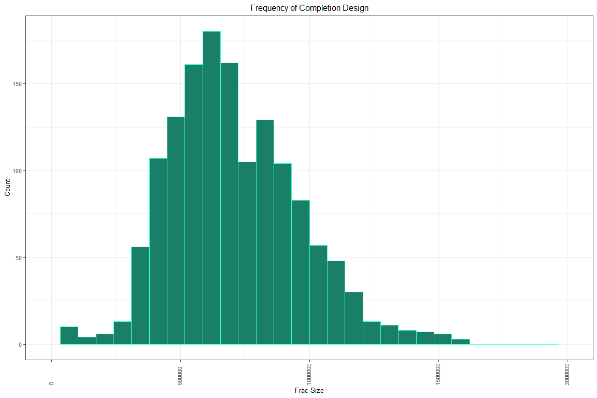

<!-- ```{r code = readLines('Setup.R'), message=FALSE, warning=FALSE} -->
<!-- ``` -->


# Executive Summary

FTNF Analytics is a boutique firm specializing in statistics and data analysis for the energy sector.  The FTNF team includes experts in geology, data visualization, statistics, and predictive modeling.  Our practice services producers globally with a special emphasis on those operating in the Southwest United States.

The Consortium of Texas Oil Producers (CTOP), has engaged FTNF to develop a study to better understand the potential for production in designated areas and help decide the best way to allocate their valuable resources.  Specifically, CTOP needs a way to predict potential energy production (and revenues generated).

FTNF is the ideal partner for this undertaking.  Our process includes enriching existing CTOP data to improve the ability to predict production outcomes.  We start with exploring the data, creating new data, and augmenting the data.  Once satisfied, we proceed to analyzing the data using contemporary statistical methods.  From there, we build predictive models to provide insight necessary to make drilling decisions.

CTOP companies no longer have to rely on hope as a strategy for finding productive wells.  With the help of FTNF Analytics, you can rely on sound science and quantifiable predictions.


# Frac Focus Data Source

The Hydraulic Fracturing Disclosure and Education websites found [here](http://fracfocusdata.org) are being hosted by the Ground Water Protection Council (GWPC) and the Interstate Oil and Gas Compact Commission (IOGCC).  This website provides a central location for public and industry to communicate and relay information on the chemicals used during the process of hydraulic fracturing of oil or gas wells.  The FracFocus website provides impartial and balanced education tools to the public on the topic of hydraulic fracturing.

The GWPC and IOGCC are uniquely suited to host these websites due to their impartial nature and ties to the regulated and regulatory community. This website provides a means for industry to voluntarily supply hydraulic fracturng chemical data in a consistent and centralized location.  This open process assists both public and industry by supplying a centralized repository for the data and removing similar fragmented efforts from around the web. 

These websites provide the following:
A means to Search for voluntarily submitted chemical records by State/County, Operator and Well.
An Education and Informative site for the public and industry on Hydraulic Fracturing Chemicals and the processes used in Hydraulic Fracturing of wells.

The data related to chemicals used to enrich the data on wells comes from the chemical registry website FracFocus.com.  The FracFocus website and data is maintained by two organizations:  Interstate Oil and Gas Compact Commission and the Ground Water Protection Council.

The site maintains data on over 127,000 wells and includes not only data about which chemicals are used, but also data about groundwater protection. FracFocus has instituted a Help Desk to address any issues you may have in using the system. You can reach the Help Desk Monday-Thursday from 8 AM to 5 PM and on Friday from 8 AM to 4 PM CDT at 405-607-6808.


## FracFocus Dataset Import
### 19 of the 24 variables are selected for the study
The deata from FracFocus is obtained via an API call.  For the sake of reproducibility,
the API call is made outside of the code and the resulting CSV is stored in the 
program repository.


```r
#import fracfocus data
fracfocus <- read.csv("../data/fracfocus_registry.csv") %>%
              standardize_names() %>%
              rename(api14='apinumber') %>%
              mutate( api14=as.character(api14)
                     ,api10 = as.character(api10)
                     ,tvd = as.integer(tvd)
                     ,jobstartdate = as.Date(jobstartdate, "%m/%d/%Y")
                     ,jobenddate = as.Date(jobenddate, "%m/%d/%Y")
                     ,jobduration = jobenddate - jobstartdate
                     ,totalbasewatervolume = as.double(totalbasewatervolume)
                     ,totalbasenonwatervolume = as.double(totalbasenonwatervolume)
                     ,percenthighadditive = as.double(percenthighadditive)
                     ,percenthfjob = as.double(percenthfjob)
                     ,massingredient = as.double(massingredient)
                     ,iswater = as.logical.factor(iswater)
                     ) %>%
              select( api14
                     ,api10
                     ,wellname
                     ,operatorname
                     ,tvd
                     ,jobstartdate
                     ,jobenddate
                     ,jobduration
                     ,latitude
                     ,longitude
                     ,totalbasewatervolume
                     ,totalbasenonwatervolume
                     ,statename
                     ,countyname
                     ,ingredientname
                     ,percenthighadditive
                     ,percenthfjob
                     ,massingredient
                     ,iswater
                     ) %>%
             as.tibble()
```

## Count Locations and Wellbores
### The FracFocus Data consists of Well Data for 3162 locations with 3163 wellbores

```r
# count unique wellbores. api14 represents a unique wellbore.
ff_wellcount <- fracfocus %>%
    select(api14) %>%
    distinct(api14) %>%
    summarize(wellbores = n())

# count unique locations. api10 represents a unique XY coordinate pair.
ff_loccount <- fracfocus %>%
    select(api10) %>%
    distinct(api10) %>%
    summarize(locations = n())

kable(data.frame("Distinct Locations" = ff_loccount
                ,"Unique Wellbores" = ff_wellcount
                ,row.names=c("Frac_Focus"))
        , digits = 0) %>%
    kable_styling(position = "center"
                 ,full_width = FALSE
                 )
```

<table class="table" style="width: auto !important; margin-left: auto; margin-right: auto;">
 <thead>
  <tr>
   <th style="text-align:left;">   </th>
   <th style="text-align:right;"> locations </th>
   <th style="text-align:right;"> wellbores </th>
  </tr>
 </thead>
<tbody>
  <tr>
   <td style="text-align:left;"> Frac_Focus </td>
   <td style="text-align:right;"> 3162 </td>
   <td style="text-align:right;"> 3163 </td>
  </tr>
</tbody>
</table>

## Aggregate Proppant and Water by wellbore
### Filtering and grouping of aggregates proponents and water for each wellbore

```r
# create a tidy table summarizing the data imported from the FracFocus registry
ff_summary <- fracfocus %>%
    filter('sand' %in% ingredientname
        | 'silica' %in% ingredientname
        | 'propp' %in% ingredientname
        | 'mesh' %in% ingredientname
        | 'brown' %in% ingredientname
        | 'white' %in% ingredientname
        | '30%50' %in% ingredientname
        | '40%70' %in% ingredientname
        | '30%50' %in% ingredientname
        | '100' %in% ingredientname
        ) %>%
    group_by(api10) %>%
    summarize(totalwater.gal = max(totalbasewatervolume)
              ,totalwater.bbl = totalwater.gal/42
              ,totalsand.lb = sum(massingredient)
              ,tvd.ft = max(tvd)
              ,jobduration.day = max(jobduration)
              #, percenthfjob = sum(percenthfjob)
              # add additional summary variables here.
              ) %>%
    inner_join(
                fracfocus %>%
                    group_by(api10) %>%
                    summarize(additive.ct = n_distinct(ingredientname))
                ,by = c("api10", "api10")
              )

# ff_units <- data.frame(
#         vars = c("api10", "totalwater","totalsand", "tvd"),
#         units = c("","(gal)","(lbs)", "(ft)"))
```

## Aggregates
### A table of FracFocus wellbore specific descriptive statistics

```r
# generate descriptive statistics for the summarized chemical data
kable(descr(ff_summary), digits = 0) %>%
    kable_styling(position = "center"
                 ,full_width = FALSE
                 )
```

<table class="table" style="width: auto !important; margin-left: auto; margin-right: auto;">
 <thead>
  <tr>
   <th style="text-align:left;">   </th>
   <th style="text-align:right;"> Mean </th>
   <th style="text-align:right;"> Std.Dev </th>
   <th style="text-align:right;"> Min </th>
   <th style="text-align:right;"> Median </th>
   <th style="text-align:right;"> Max </th>
   <th style="text-align:right;"> Q1 </th>
   <th style="text-align:right;"> Q3 </th>
   <th style="text-align:right;"> N.Valid </th>
  </tr>
 </thead>
<tbody>
  <tr>
   <td style="text-align:left;"> totalwater.gal </td>
   <td style="text-align:right;"> 8631322 </td>
   <td style="text-align:right;"> 8517091 </td>
   <td style="text-align:right;"> 0 </td>
   <td style="text-align:right;"> 7960218 </td>
   <td style="text-align:right;"> 202222958 </td>
   <td style="text-align:right;"> 1348074 </td>
   <td style="text-align:right;"> 13285482 </td>
   <td style="text-align:right;"> 3162 </td>
  </tr>
  <tr>
   <td style="text-align:left;"> totalwater.bbl </td>
   <td style="text-align:right;"> 205508 </td>
   <td style="text-align:right;"> 202788 </td>
   <td style="text-align:right;"> 0 </td>
   <td style="text-align:right;"> 189529 </td>
   <td style="text-align:right;"> 4814832 </td>
   <td style="text-align:right;"> 32097 </td>
   <td style="text-align:right;"> 316321 </td>
   <td style="text-align:right;"> 3162 </td>
  </tr>
  <tr>
   <td style="text-align:left;"> totalsand.lb </td>
   <td style="text-align:right;"> 834510 </td>
   <td style="text-align:right;"> 520151 </td>
   <td style="text-align:right;"> 1 </td>
   <td style="text-align:right;"> 807304 </td>
   <td style="text-align:right;"> 4556769 </td>
   <td style="text-align:right;"> 556858 </td>
   <td style="text-align:right;"> 1117587 </td>
   <td style="text-align:right;"> 3162 </td>
  </tr>
  <tr>
   <td style="text-align:left;"> tvd.ft </td>
   <td style="text-align:right;"> 88518 </td>
   <td style="text-align:right;"> 4445993 </td>
   <td style="text-align:right;"> 0 </td>
   <td style="text-align:right;"> 9281 </td>
   <td style="text-align:right;"> 250014549 </td>
   <td style="text-align:right;"> 8011 </td>
   <td style="text-align:right;"> 10575 </td>
   <td style="text-align:right;"> 3162 </td>
  </tr>
  <tr>
   <td style="text-align:left;"> additive.ct </td>
   <td style="text-align:right;"> 32 </td>
   <td style="text-align:right;"> 13 </td>
   <td style="text-align:right;"> 1 </td>
   <td style="text-align:right;"> 30 </td>
   <td style="text-align:right;"> 86 </td>
   <td style="text-align:right;"> 21 </td>
   <td style="text-align:right;"> 42 </td>
   <td style="text-align:right;"> 3162 </td>
  </tr>
</tbody>
</table>

# Driftwood Well Data Source

The Driftwood dataset was provided by the client and can be found [here](https://github.com/la-mar/DDS_Case_Study_2/blob/master/data/deo_well_data.csv). This dataset provides a central location for wellsites to communicate and relay information on the drilling parameters used during the process of extraction of oil or gas wells. The following variables are included within the dataset:

* API - fourteen digit american petroleum institue number
* API10 - ten digit american petroleum institue number. Represents a unique hole in the ground.
* oper_alias - standardized operator (company) names
* Form_Avg - geological formation names
* PerfLL - wellbore lateral length
* FirstProd - date of first oil/gas production
* Oil_PkNorm_PerK_6mo - peak oil production within the first 6 months of first production, normalized to 1000 ft 


## Well Features and Characteristics Dataset Import

### 7 of the 8 variables are selected for the study

```r
# import data features of individual wells
wellfeatures <- read.csv("../data/deo_well_data.csv") %>%
             standardize_names() %>% 
             rename(oil.pk.bbl='oilpknormperk6mo'
                    ,api14='api'
                    ,perfll.ft='perfll') %>%
             mutate(api14 = as.character(api14)
                   ,api10 = as.character(api10)
                   ,perfll.ft=as.integer(perfll.ft)
                   ,firstprod = as.Date(firstprod, "%m/%d/%Y")
                   ,oil.pk.bbl = as.integer(oil.pk.bbl)
                   ,vintage.yr = as.integer(format(firstprod, '%Y'))
                   ,age.mo = as.integer((as.Date('08/01/2018', "%m/%d/%Y") - firstprod)/(365/12)) #30.4 = avg month duration
                ) %>%
             as.tibble()


# wf_units <- data.frame(
#         vars = c("api14","api10","operalias","formavg","status"    
#                 ,"perfll","firstprod","oil.pk","vintage","age.mo"),
#         units = c("","","","",""    
#                 ,"(ft)","","(bbl/day)","(year)","(months)"))


# wellfeatures %>% head()

# wellfeatures %>% 
# mutate(age.mo = as.integer((as.Date('08/01/2018', "%m/%d/%Y") - firstprod)/30.4)) %>%
# select(firstprod, age.mo) %>%
# head() 

# class(as.Date('08/01/2018', "%m/%d/%Y"))
# wellfeatures$firstprod - as.Date('08/01/2018', "%m/%d/%Y")

#read.csv("../data/deo_well_data.csv") %>%standardize_names() %>%  head()
```

## Count Locations and Wellbores
### The Well Features and Characteristics consists of Well Data for 2907 locations with 2914 wellbores

```r
# count unique wellbores. api14 represents a unique wellbore.
wf_wellcount <- wellfeatures %>%
    select(api14) %>%
    distinct(api14) %>%
    summarize(wellbores = n())

# count unique locations. api10 represents a unique XY coordinate pair.
wf_loccount <- wellfeatures %>%
    select(api10) %>%
    distinct(api10) %>%
    summarize(locations = n())

kable(data.frame("Distinct Locations" = wf_loccount
                ,"Unique Wellbores" = wf_wellcount
                ,row.names=c("Well_Features")
                )
          , digits = 0) %>%
        kable_styling(position = "float_right", 
                full_width = FALSE,
                bootstrap_options = c("striped", "hover", "condensed")
                )
```

<table class="table table-striped table-hover table-condensed" style="width: auto !important; float: right; margin-left: 10px;">
 <thead>
  <tr>
   <th style="text-align:left;">   </th>
   <th style="text-align:right;"> locations </th>
   <th style="text-align:right;"> wellbores </th>
  </tr>
 </thead>
<tbody>
  <tr>
   <td style="text-align:left;"> Well_Features </td>
   <td style="text-align:right;"> 2907 </td>
   <td style="text-align:right;"> 2914 </td>
  </tr>
</tbody>
</table>

## Aggregates
### A table of Well Features and Characteristics wellbore specific descriptive statistics

```r
# generate descriptive statistics for the summarized chemical data
kable(descr(ff_summary), digits = 0) %>%
    kable_styling(position = "center"
                 ,full_width = FALSE
                 )
```

<table class="table" style="width: auto !important; margin-left: auto; margin-right: auto;">
 <thead>
  <tr>
   <th style="text-align:left;">   </th>
   <th style="text-align:right;"> Mean </th>
   <th style="text-align:right;"> Std.Dev </th>
   <th style="text-align:right;"> Min </th>
   <th style="text-align:right;"> Median </th>
   <th style="text-align:right;"> Max </th>
   <th style="text-align:right;"> Q1 </th>
   <th style="text-align:right;"> Q3 </th>
   <th style="text-align:right;"> N.Valid </th>
  </tr>
 </thead>
<tbody>
  <tr>
   <td style="text-align:left;"> totalwater.gal </td>
   <td style="text-align:right;"> 8631322 </td>
   <td style="text-align:right;"> 8517091 </td>
   <td style="text-align:right;"> 0 </td>
   <td style="text-align:right;"> 7960218 </td>
   <td style="text-align:right;"> 202222958 </td>
   <td style="text-align:right;"> 1348074 </td>
   <td style="text-align:right;"> 13285482 </td>
   <td style="text-align:right;"> 3162 </td>
  </tr>
  <tr>
   <td style="text-align:left;"> totalwater.bbl </td>
   <td style="text-align:right;"> 205508 </td>
   <td style="text-align:right;"> 202788 </td>
   <td style="text-align:right;"> 0 </td>
   <td style="text-align:right;"> 189529 </td>
   <td style="text-align:right;"> 4814832 </td>
   <td style="text-align:right;"> 32097 </td>
   <td style="text-align:right;"> 316321 </td>
   <td style="text-align:right;"> 3162 </td>
  </tr>
  <tr>
   <td style="text-align:left;"> totalsand.lb </td>
   <td style="text-align:right;"> 834510 </td>
   <td style="text-align:right;"> 520151 </td>
   <td style="text-align:right;"> 1 </td>
   <td style="text-align:right;"> 807304 </td>
   <td style="text-align:right;"> 4556769 </td>
   <td style="text-align:right;"> 556858 </td>
   <td style="text-align:right;"> 1117587 </td>
   <td style="text-align:right;"> 3162 </td>
  </tr>
  <tr>
   <td style="text-align:left;"> tvd.ft </td>
   <td style="text-align:right;"> 88518 </td>
   <td style="text-align:right;"> 4445993 </td>
   <td style="text-align:right;"> 0 </td>
   <td style="text-align:right;"> 9281 </td>
   <td style="text-align:right;"> 250014549 </td>
   <td style="text-align:right;"> 8011 </td>
   <td style="text-align:right;"> 10575 </td>
   <td style="text-align:right;"> 3162 </td>
  </tr>
  <tr>
   <td style="text-align:left;"> additive.ct </td>
   <td style="text-align:right;"> 32 </td>
   <td style="text-align:right;"> 13 </td>
   <td style="text-align:right;"> 1 </td>
   <td style="text-align:right;"> 30 </td>
   <td style="text-align:right;"> 86 </td>
   <td style="text-align:right;"> 21 </td>
   <td style="text-align:right;"> 42 </td>
   <td style="text-align:right;"> 3162 </td>
  </tr>
</tbody>
</table>

# Exploration of Datasets

Here the FracFocus and Well Features and Characteristics datasets are joined into a new dataset named welldata by the common variable api10, which represents a specific wellbore hole.


## Add Calculated Columns to Well Data
### Columns are created by the mutate function to provide 8 new variables for upcomming data analysis

```r
# create new table by joining data on wells with data on chemicals
welldata <- wellfeatures %>%
    inner_join(ff_summary, by = c("api10", "api10")) %>%
    #rename(vintage.yr = vintage) %>%
    mutate(lb.ft = totalsand.lb / perfll.ft
           , gal.ft = totalwater.gal / perfll.ft #todo: totalwater bbl looks way too high.
           , bbl.ft = gal.ft / 42
           , distance = sqrt(gal.ft ^ 2 + lb.ft ^ 2) * (180 / pi) # linear_distance_from_origin (hypotenuse length)
           , angle = atan(gal.ft / lb.ft) * (180 / pi) #in degrees
           , deviation = abs(45 - angle) #deviation_from_45deg
           , weight = 500 # weighting_constant
           , frac.size = distance-(deviation-weight) # weighted_distance_from_origin
           ) %>%
           select(-distance, -angle, -deviation, -weight)
```


```r
# function call to provide summary statistics for well data
    kable(descr(welldata), digits = 0) %>%
    kable_styling(position = "center"
                 ,full_width = TRUE)
```

<table class="table" style="margin-left: auto; margin-right: auto;">
 <thead>
  <tr>
   <th style="text-align:left;">   </th>
   <th style="text-align:right;"> Mean </th>
   <th style="text-align:right;"> Std.Dev </th>
   <th style="text-align:right;"> Min </th>
   <th style="text-align:right;"> Median </th>
   <th style="text-align:right;"> Max </th>
   <th style="text-align:right;"> Q1 </th>
   <th style="text-align:right;"> Q3 </th>
   <th style="text-align:right;"> N.Valid </th>
  </tr>
 </thead>
<tbody>
  <tr>
   <td style="text-align:left;"> perfll.ft </td>
   <td style="text-align:right;"> 868 </td>
   <td style="text-align:right;"> 491 </td>
   <td style="text-align:right;"> 1 </td>
   <td style="text-align:right;"> 909 </td>
   <td style="text-align:right;"> 1570 </td>
   <td style="text-align:right;"> 524 </td>
   <td style="text-align:right;"> 1288 </td>
   <td style="text-align:right;"> 1908 </td>
  </tr>
  <tr>
   <td style="text-align:left;"> oil.pk.bbl </td>
   <td style="text-align:right;"> 1071 </td>
   <td style="text-align:right;"> 601 </td>
   <td style="text-align:right;"> 1 </td>
   <td style="text-align:right;"> 1104 </td>
   <td style="text-align:right;"> 1854 </td>
   <td style="text-align:right;"> 541 </td>
   <td style="text-align:right;"> 1650 </td>
   <td style="text-align:right;"> 1908 </td>
  </tr>
  <tr>
   <td style="text-align:left;"> vintage.yr </td>
   <td style="text-align:right;"> 2015 </td>
   <td style="text-align:right;"> 2 </td>
   <td style="text-align:right;"> 2001 </td>
   <td style="text-align:right;"> 2015 </td>
   <td style="text-align:right;"> 2018 </td>
   <td style="text-align:right;"> 2014 </td>
   <td style="text-align:right;"> 2016 </td>
   <td style="text-align:right;"> 1742 </td>
  </tr>
  <tr>
   <td style="text-align:left;"> age.mo </td>
   <td style="text-align:right;"> 35 </td>
   <td style="text-align:right;"> 18 </td>
   <td style="text-align:right;"> 5 </td>
   <td style="text-align:right;"> 37 </td>
   <td style="text-align:right;"> 209 </td>
   <td style="text-align:right;"> 19 </td>
   <td style="text-align:right;"> 47 </td>
   <td style="text-align:right;"> 1742 </td>
  </tr>
  <tr>
   <td style="text-align:left;"> totalwater.gal </td>
   <td style="text-align:right;"> 13387410 </td>
   <td style="text-align:right;"> 7837647 </td>
   <td style="text-align:right;"> 0 </td>
   <td style="text-align:right;"> 11351928 </td>
   <td style="text-align:right;"> 202222958 </td>
   <td style="text-align:right;"> 8640555 </td>
   <td style="text-align:right;"> 17433362 </td>
   <td style="text-align:right;"> 1908 </td>
  </tr>
  <tr>
   <td style="text-align:left;"> totalwater.bbl </td>
   <td style="text-align:right;"> 318748 </td>
   <td style="text-align:right;"> 186611 </td>
   <td style="text-align:right;"> 0 </td>
   <td style="text-align:right;"> 270284 </td>
   <td style="text-align:right;"> 4814832 </td>
   <td style="text-align:right;"> 205728 </td>
   <td style="text-align:right;"> 415080 </td>
   <td style="text-align:right;"> 1908 </td>
  </tr>
  <tr>
   <td style="text-align:left;"> totalsand.lb </td>
   <td style="text-align:right;"> 774981 </td>
   <td style="text-align:right;"> 529758 </td>
   <td style="text-align:right;"> 7 </td>
   <td style="text-align:right;"> 763048 </td>
   <td style="text-align:right;"> 4496574 </td>
   <td style="text-align:right;"> 488646 </td>
   <td style="text-align:right;"> 1065444 </td>
   <td style="text-align:right;"> 1908 </td>
  </tr>
  <tr>
   <td style="text-align:left;"> tvd.ft </td>
   <td style="text-align:right;"> 8895 </td>
   <td style="text-align:right;"> 3183 </td>
   <td style="text-align:right;"> 0 </td>
   <td style="text-align:right;"> 8649 </td>
   <td style="text-align:right;"> 92089 </td>
   <td style="text-align:right;"> 7758 </td>
   <td style="text-align:right;"> 9426 </td>
   <td style="text-align:right;"> 1908 </td>
  </tr>
  <tr>
   <td style="text-align:left;"> additive.ct </td>
   <td style="text-align:right;"> 33 </td>
   <td style="text-align:right;"> 13 </td>
   <td style="text-align:right;"> 5 </td>
   <td style="text-align:right;"> 31 </td>
   <td style="text-align:right;"> 86 </td>
   <td style="text-align:right;"> 23 </td>
   <td style="text-align:right;"> 44 </td>
   <td style="text-align:right;"> 1908 </td>
  </tr>
  <tr>
   <td style="text-align:left;"> lb.ft </td>
   <td style="text-align:right;"> 39384 </td>
   <td style="text-align:right;"> 204467 </td>
   <td style="text-align:right;"> 0 </td>
   <td style="text-align:right;"> 871 </td>
   <td style="text-align:right;"> 2292880 </td>
   <td style="text-align:right;"> 433 </td>
   <td style="text-align:right;"> 1765 </td>
   <td style="text-align:right;"> 1908 </td>
  </tr>
  <tr>
   <td style="text-align:left;"> gal.ft </td>
   <td style="text-align:right;"> 803290 </td>
   <td style="text-align:right;"> 5707366 </td>
   <td style="text-align:right;"> 0 </td>
   <td style="text-align:right;"> 12953 </td>
   <td style="text-align:right;"> 202222958 </td>
   <td style="text-align:right;"> 9761 </td>
   <td style="text-align:right;"> 17991 </td>
   <td style="text-align:right;"> 1908 </td>
  </tr>
  <tr>
   <td style="text-align:left;"> bbl.ft </td>
   <td style="text-align:right;"> 19126 </td>
   <td style="text-align:right;"> 135890 </td>
   <td style="text-align:right;"> 0 </td>
   <td style="text-align:right;"> 308 </td>
   <td style="text-align:right;"> 4814832 </td>
   <td style="text-align:right;"> 232 </td>
   <td style="text-align:right;"> 428 </td>
   <td style="text-align:right;"> 1908 </td>
  </tr>
  <tr>
   <td style="text-align:left;"> frac.size </td>
   <td style="text-align:right;"> 46224719 </td>
   <td style="text-align:right;"> 327197476 </td>
   <td style="text-align:right;"> 23658 </td>
   <td style="text-align:right;"> 747575 </td>
   <td style="text-align:right;"> 11586664381 </td>
   <td style="text-align:right;"> 563766 </td>
   <td style="text-align:right;"> 1035822 </td>
   <td style="text-align:right;"> 1908 </td>
  </tr>
</tbody>
</table>

## Munge Datasets
### Here the welldata is cleaned in preparation for statistical procedures and visualization

```r
# Before developing models and making predictions, it's important to understand the data.
# Here we're summarize the data mathematically and explore it visually.

# create a count of well observations
wd_nrow <- list()
wd_nrow[['All Records']] <- nrow(welldata)
```


```r
# remove observations with insufficient information    
welldata <- welldata %<>% 
                filter(!formavg %in% c("UNKNOWN","GRID_ERROR"))
```


```r
# provide count of observations that will be used for analysis
wd_nrow[['Cleaned Forms']] <- nrow(welldata)
```


```r
# summarizes the number of "clean" observations
wd_nrow[['Cleaned Frac Size']] <- nrow(welldata)
```


```r
# summarizes the number of observations after 
# removing NAs from vintage column
welldata <- welldata %>% na.omit(vintage.yr)

wd_nrow[['Cleaned Vintage']] <- nrow(welldata)
# wd_nrow %>% as.data.frame()
```


```r
 kable(wd_nrow %>% as.data.frame()) %>%
    kable_styling(position = "center"
                 ,full_width = TRUE) %>%
 add_header_above(c(" ", "Cleansed" = 3))
```

<table class="table" style="margin-left: auto; margin-right: auto;">
 <thead>
<tr>
<th style="border-bottom:hidden" colspan="1"></th>
<th style="border-bottom:hidden; padding-bottom:0; padding-left:3px;padding-right:3px;text-align: center; " colspan="3"><div style="border-bottom: 1px solid #ddd; padding-bottom: 5px;">Cleansed</div></th>
</tr>
  <tr>
   <th style="text-align:right;"> All.Records </th>
   <th style="text-align:right;"> Cleaned.Forms </th>
   <th style="text-align:right;"> Cleaned.Frac.Size </th>
   <th style="text-align:right;"> Cleaned.Vintage </th>
  </tr>
 </thead>
<tbody>
  <tr>
   <td style="text-align:right;"> 1908 </td>
   <td style="text-align:right;"> 1856 </td>
   <td style="text-align:right;"> 1856 </td>
   <td style="text-align:right;"> 1715 </td>
  </tr>
</tbody>
</table>

## Summarize Well Data 
### A table of Well Data wellbore specific descriptive statistics

```r
# function call to provide summary statistics for well data
    kable(descr(welldata), digits = 0) %>%
    kable_styling(position = "center"
                 ,full_width = TRUE)
```

<table class="table" style="margin-left: auto; margin-right: auto;">
 <thead>
  <tr>
   <th style="text-align:left;">   </th>
   <th style="text-align:right;"> Mean </th>
   <th style="text-align:right;"> Std.Dev </th>
   <th style="text-align:right;"> Min </th>
   <th style="text-align:right;"> Median </th>
   <th style="text-align:right;"> Max </th>
   <th style="text-align:right;"> Q1 </th>
   <th style="text-align:right;"> Q3 </th>
   <th style="text-align:right;"> N.Valid </th>
  </tr>
 </thead>
<tbody>
  <tr>
   <td style="text-align:left;"> perfll.ft </td>
   <td style="text-align:right;"> 844 </td>
   <td style="text-align:right;"> 458 </td>
   <td style="text-align:right;"> 1 </td>
   <td style="text-align:right;"> 895 </td>
   <td style="text-align:right;"> 1570 </td>
   <td style="text-align:right;"> 530 </td>
   <td style="text-align:right;"> 1216 </td>
   <td style="text-align:right;"> 1715 </td>
  </tr>
  <tr>
   <td style="text-align:left;"> oil.pk.bbl </td>
   <td style="text-align:right;"> 997 </td>
   <td style="text-align:right;"> 576 </td>
   <td style="text-align:right;"> 1 </td>
   <td style="text-align:right;"> 1022 </td>
   <td style="text-align:right;"> 1854 </td>
   <td style="text-align:right;"> 487 </td>
   <td style="text-align:right;"> 1508 </td>
   <td style="text-align:right;"> 1715 </td>
  </tr>
  <tr>
   <td style="text-align:left;"> vintage.yr </td>
   <td style="text-align:right;"> 2015 </td>
   <td style="text-align:right;"> 1 </td>
   <td style="text-align:right;"> 2001 </td>
   <td style="text-align:right;"> 2015 </td>
   <td style="text-align:right;"> 2018 </td>
   <td style="text-align:right;"> 2014 </td>
   <td style="text-align:right;"> 2016 </td>
   <td style="text-align:right;"> 1715 </td>
  </tr>
  <tr>
   <td style="text-align:left;"> age.mo </td>
   <td style="text-align:right;"> 34 </td>
   <td style="text-align:right;"> 17 </td>
   <td style="text-align:right;"> 5 </td>
   <td style="text-align:right;"> 37 </td>
   <td style="text-align:right;"> 209 </td>
   <td style="text-align:right;"> 19 </td>
   <td style="text-align:right;"> 47 </td>
   <td style="text-align:right;"> 1715 </td>
  </tr>
  <tr>
   <td style="text-align:left;"> totalwater.gal </td>
   <td style="text-align:right;"> 13030462 </td>
   <td style="text-align:right;"> 7697296 </td>
   <td style="text-align:right;"> 0 </td>
   <td style="text-align:right;"> 11018196 </td>
   <td style="text-align:right;"> 202222958 </td>
   <td style="text-align:right;"> 8543724 </td>
   <td style="text-align:right;"> 16540356 </td>
   <td style="text-align:right;"> 1715 </td>
  </tr>
  <tr>
   <td style="text-align:left;"> totalwater.bbl </td>
   <td style="text-align:right;"> 310249 </td>
   <td style="text-align:right;"> 183269 </td>
   <td style="text-align:right;"> 0 </td>
   <td style="text-align:right;"> 262338 </td>
   <td style="text-align:right;"> 4814832 </td>
   <td style="text-align:right;"> 203422 </td>
   <td style="text-align:right;"> 393818 </td>
   <td style="text-align:right;"> 1715 </td>
  </tr>
  <tr>
   <td style="text-align:left;"> totalsand.lb </td>
   <td style="text-align:right;"> 781277 </td>
   <td style="text-align:right;"> 536322 </td>
   <td style="text-align:right;"> 7 </td>
   <td style="text-align:right;"> 776275 </td>
   <td style="text-align:right;"> 4496574 </td>
   <td style="text-align:right;"> 487398 </td>
   <td style="text-align:right;"> 1082611 </td>
   <td style="text-align:right;"> 1715 </td>
  </tr>
  <tr>
   <td style="text-align:left;"> tvd.ft </td>
   <td style="text-align:right;"> 8971 </td>
   <td style="text-align:right;"> 3276 </td>
   <td style="text-align:right;"> 0 </td>
   <td style="text-align:right;"> 8669 </td>
   <td style="text-align:right;"> 92089 </td>
   <td style="text-align:right;"> 7800 </td>
   <td style="text-align:right;"> 9426 </td>
   <td style="text-align:right;"> 1715 </td>
  </tr>
  <tr>
   <td style="text-align:left;"> additive.ct </td>
   <td style="text-align:right;"> 33 </td>
   <td style="text-align:right;"> 13 </td>
   <td style="text-align:right;"> 5 </td>
   <td style="text-align:right;"> 31 </td>
   <td style="text-align:right;"> 86 </td>
   <td style="text-align:right;"> 23 </td>
   <td style="text-align:right;"> 44 </td>
   <td style="text-align:right;"> 1715 </td>
  </tr>
  <tr>
   <td style="text-align:left;"> lb.ft </td>
   <td style="text-align:right;"> 25528 </td>
   <td style="text-align:right;"> 167913 </td>
   <td style="text-align:right;"> 0 </td>
   <td style="text-align:right;"> 910 </td>
   <td style="text-align:right;"> 2143603 </td>
   <td style="text-align:right;"> 448 </td>
   <td style="text-align:right;"> 1766 </td>
   <td style="text-align:right;"> 1715 </td>
  </tr>
  <tr>
   <td style="text-align:left;"> gal.ft </td>
   <td style="text-align:right;"> 494862 </td>
   <td style="text-align:right;"> 5401735 </td>
   <td style="text-align:right;"> 0 </td>
   <td style="text-align:right;"> 12905 </td>
   <td style="text-align:right;"> 202222958 </td>
   <td style="text-align:right;"> 9737 </td>
   <td style="text-align:right;"> 17851 </td>
   <td style="text-align:right;"> 1715 </td>
  </tr>
  <tr>
   <td style="text-align:left;"> bbl.ft </td>
   <td style="text-align:right;"> 11782 </td>
   <td style="text-align:right;"> 128613 </td>
   <td style="text-align:right;"> 0 </td>
   <td style="text-align:right;"> 307 </td>
   <td style="text-align:right;"> 4814832 </td>
   <td style="text-align:right;"> 232 </td>
   <td style="text-align:right;"> 425 </td>
   <td style="text-align:right;"> 1715 </td>
  </tr>
  <tr>
   <td style="text-align:left;"> frac.size </td>
   <td style="text-align:right;"> 28541135 </td>
   <td style="text-align:right;"> 309632332 </td>
   <td style="text-align:right;"> 23658 </td>
   <td style="text-align:right;"> 745429 </td>
   <td style="text-align:right;"> 11586664381 </td>
   <td style="text-align:right;"> 560992 </td>
   <td style="text-align:right;"> 1025937 </td>
   <td style="text-align:right;"> 1715 </td>
  </tr>
</tbody>
</table>
## Well Data Box Plot
### A visualization of the summary statistics for Well Data

```r
# create a summary boxplot of wells by size
ggplot((welldata), #%>% na.omit(abv)), 
       aes(x=reorder(formavg, tvd.ft, FUN=mean) , y=log(frac.size), fill = formavg)) +
  geom_boxplot() +
  scale_fill_manual(values = COL.ALLFORMS) +
  scale_x_discrete(limits = rev(names(COL.ALLFORMS))) + #manually set x.axis order
  ggtitle("Frac Size by Formation") +
  xlab("Geological Formation") +
  ylab("Frac Size (dimensionless)") +
  coord_flip() +
  theme(text = element_text(size=10),
        axis.text.x = element_text(angle=90, vjust=0.5),
        plot.title = element_text(hjust = 0.5, size = 16))
```

<!-- -->


```r
# create a summary boxplot of wells by size
ggplot((welldata), #%>% na.omit(abv)), 
       aes(x=reorder(formavg, tvd.ft, FUN=mean) , y=log(frac.size), fill = formavg)) +
  geom_boxplot() +
  scale_fill_manual(values = COL.ALLFORMS) +
  scale_x_discrete(limits = rev(names(COL.ALLFORMS))) + #manually set x.axis order
  ggtitle("Frac Size by Formation") +
  xlab("Geological Formation") +
  ylab("Frac Size (dimensionless)") +
  coord_flip() +
  theme(text = element_text(size=10),
        axis.text.x = element_text(angle=90, vjust=0.5),
        plot.title = element_text(hjust = 0.5, size = 16))
```

<!-- -->

## Wellsite Frequencies
### A table of well frequency by respective year

```r
# calculate frequency of wells by year 
kable(freq(welldata$vintage.yr), digits = 0) %>% 
    kable_styling(position = "left", 
                  full_width = FALSE
                 )
```

<table class="table" style="width: auto !important; ">
 <thead>
  <tr>
   <th style="text-align:left;">   </th>
   <th style="text-align:right;"> Freq </th>
   <th style="text-align:right;"> % Valid </th>
   <th style="text-align:right;"> % Valid Cum. </th>
   <th style="text-align:right;"> % Total </th>
   <th style="text-align:right;"> % Total Cum. </th>
  </tr>
 </thead>
<tbody>
  <tr>
   <td style="text-align:left;"> 2001 </td>
   <td style="text-align:right;"> 2 </td>
   <td style="text-align:right;"> 0 </td>
   <td style="text-align:right;"> 0 </td>
   <td style="text-align:right;"> 0 </td>
   <td style="text-align:right;"> 0 </td>
  </tr>
  <tr>
   <td style="text-align:left;"> 2011 </td>
   <td style="text-align:right;"> 1 </td>
   <td style="text-align:right;"> 0 </td>
   <td style="text-align:right;"> 0 </td>
   <td style="text-align:right;"> 0 </td>
   <td style="text-align:right;"> 0 </td>
  </tr>
  <tr>
   <td style="text-align:left;"> 2012 </td>
   <td style="text-align:right;"> 16 </td>
   <td style="text-align:right;"> 1 </td>
   <td style="text-align:right;"> 1 </td>
   <td style="text-align:right;"> 1 </td>
   <td style="text-align:right;"> 1 </td>
  </tr>
  <tr>
   <td style="text-align:left;"> 2013 </td>
   <td style="text-align:right;"> 139 </td>
   <td style="text-align:right;"> 8 </td>
   <td style="text-align:right;"> 9 </td>
   <td style="text-align:right;"> 8 </td>
   <td style="text-align:right;"> 9 </td>
  </tr>
  <tr>
   <td style="text-align:left;"> 2014 </td>
   <td style="text-align:right;"> 443 </td>
   <td style="text-align:right;"> 26 </td>
   <td style="text-align:right;"> 35 </td>
   <td style="text-align:right;"> 26 </td>
   <td style="text-align:right;"> 35 </td>
  </tr>
  <tr>
   <td style="text-align:left;"> 2015 </td>
   <td style="text-align:right;"> 403 </td>
   <td style="text-align:right;"> 23 </td>
   <td style="text-align:right;"> 59 </td>
   <td style="text-align:right;"> 23 </td>
   <td style="text-align:right;"> 59 </td>
  </tr>
  <tr>
   <td style="text-align:left;"> 2016 </td>
   <td style="text-align:right;"> 286 </td>
   <td style="text-align:right;"> 17 </td>
   <td style="text-align:right;"> 75 </td>
   <td style="text-align:right;"> 17 </td>
   <td style="text-align:right;"> 75 </td>
  </tr>
  <tr>
   <td style="text-align:left;"> 2017 </td>
   <td style="text-align:right;"> 374 </td>
   <td style="text-align:right;"> 22 </td>
   <td style="text-align:right;"> 97 </td>
   <td style="text-align:right;"> 22 </td>
   <td style="text-align:right;"> 97 </td>
  </tr>
  <tr>
   <td style="text-align:left;"> 2018 </td>
   <td style="text-align:right;"> 51 </td>
   <td style="text-align:right;"> 3 </td>
   <td style="text-align:right;"> 100 </td>
   <td style="text-align:right;"> 3 </td>
   <td style="text-align:right;"> 100 </td>
  </tr>
  <tr>
   <td style="text-align:left;"> &lt;NA&gt; </td>
   <td style="text-align:right;"> 0 </td>
   <td style="text-align:right;"> NA </td>
   <td style="text-align:right;"> NA </td>
   <td style="text-align:right;"> 0 </td>
   <td style="text-align:right;"> 100 </td>
  </tr>
  <tr>
   <td style="text-align:left;"> Total </td>
   <td style="text-align:right;"> 1715 </td>
   <td style="text-align:right;"> 100 </td>
   <td style="text-align:right;"> 100 </td>
   <td style="text-align:right;"> 100 </td>
   <td style="text-align:right;"> 100 </td>
  </tr>
</tbody>
</table>

## Wellsite Production Frequencies
### A table of well production by respective year

```r
# calculate frequency of wells by status
kable(freq(welldata$status), digits = 0) %>% 
    kable_styling(position = "right",
                 full_width = FALSE
                 )
```

<table class="table" style="width: auto !important; margin-right: 0; margin-left: auto">
 <thead>
  <tr>
   <th style="text-align:left;">   </th>
   <th style="text-align:right;"> Freq </th>
   <th style="text-align:right;"> % Valid </th>
   <th style="text-align:right;"> % Valid Cum. </th>
   <th style="text-align:right;"> % Total </th>
   <th style="text-align:right;"> % Total Cum. </th>
  </tr>
 </thead>
<tbody>
  <tr>
   <td style="text-align:left;"> COMPLETED </td>
   <td style="text-align:right;"> 0 </td>
   <td style="text-align:right;"> 0 </td>
   <td style="text-align:right;"> 0 </td>
   <td style="text-align:right;"> 0 </td>
   <td style="text-align:right;"> 0 </td>
  </tr>
  <tr>
   <td style="text-align:left;"> DUC </td>
   <td style="text-align:right;"> 0 </td>
   <td style="text-align:right;"> 0 </td>
   <td style="text-align:right;"> 0 </td>
   <td style="text-align:right;"> 0 </td>
   <td style="text-align:right;"> 0 </td>
  </tr>
  <tr>
   <td style="text-align:left;"> PERMIT </td>
   <td style="text-align:right;"> 0 </td>
   <td style="text-align:right;"> 0 </td>
   <td style="text-align:right;"> 0 </td>
   <td style="text-align:right;"> 0 </td>
   <td style="text-align:right;"> 0 </td>
  </tr>
  <tr>
   <td style="text-align:left;"> PRODUCING </td>
   <td style="text-align:right;"> 1705 </td>
   <td style="text-align:right;"> 99 </td>
   <td style="text-align:right;"> 99 </td>
   <td style="text-align:right;"> 99 </td>
   <td style="text-align:right;"> 99 </td>
  </tr>
  <tr>
   <td style="text-align:left;"> STALE-PERMIT </td>
   <td style="text-align:right;"> 0 </td>
   <td style="text-align:right;"> 0 </td>
   <td style="text-align:right;"> 99 </td>
   <td style="text-align:right;"> 0 </td>
   <td style="text-align:right;"> 99 </td>
  </tr>
  <tr>
   <td style="text-align:left;"> TA </td>
   <td style="text-align:right;"> 10 </td>
   <td style="text-align:right;"> 1 </td>
   <td style="text-align:right;"> 100 </td>
   <td style="text-align:right;"> 1 </td>
   <td style="text-align:right;"> 100 </td>
  </tr>
  <tr>
   <td style="text-align:left;"> &lt;NA&gt; </td>
   <td style="text-align:right;"> 0 </td>
   <td style="text-align:right;"> NA </td>
   <td style="text-align:right;"> NA </td>
   <td style="text-align:right;"> 0 </td>
   <td style="text-align:right;"> 100 </td>
  </tr>
  <tr>
   <td style="text-align:left;"> Total </td>
   <td style="text-align:right;"> 1715 </td>
   <td style="text-align:right;"> 100 </td>
   <td style="text-align:right;"> 100 </td>
   <td style="text-align:right;"> 100 </td>
   <td style="text-align:right;"> 100 </td>
  </tr>
</tbody>
</table>

## Frac Size Distribution
### Plot 1

```r

ggplot(welldata, aes(x = frac.size, fill = vintage.yr)) +
        geom_histogram() +
        #geom_freqpoly() +
        xlim(0, 2000000)
```

<!-- -->

```r


ggplot(welldata) +
      geom_bar(aes(x = reorder(vintage.yr, vintage.yr, FUN=mean),
                   y = frac.size), 
               stat ="identity",
               fill = COL.A.G) 
```

<!-- -->

### Plot 2


## Regression Model 1
### Multiple Linear Regression Model for Well Productivity given Aggregate and Formation Interaction
Some of the most interesting research findings are those involving interactions among
predictor variables. Consider the welldata oil.pk.bbl measure of production. Let’s say
that you’re interested in the impact of geological formation (formavg) and aggregates (frac.size) on well production (oil.pk.bbl). You could fit a regression model that includes both predictors, along with their
interaction, as shown in the model formula below.

 - formula = lm(log(oil.pk.bbl) ~ log(frac.size) : formavg, data=welldata)  

The formula is typically written as Y ~ X1 + X2 + ... + Xk where the ~ separates the response variable log(oil.pk.bbl) on the left from the predictor variables log(frac.size) : formavg on the right, and the predictor variables are separated by + signs. The colon is used to denote an interaction between predictor variables. A prediction of y from x, z, and the interaction between x and z would be coded y ~ x + z + x:z.

```r
#  Linear Regression Model for Well Productivity}
#Linear Regression Model formula = lm(log(oil.pk.bbl) ~ log(frac.size) : formavg, data=welldata)
well.production <- lm(log(oil.pk.bbl) ~ log(frac.size) : formavg, data = welldata)
```

The use of logarithmic transformations on the quantifiable variables is needed to meet the four linear regression assumptions of Normality, Independence, Linearity, and Homoscedasticity. These logarithmic transformations allow the model to meet all assumptions and our goal is to select model parameters (intercept and slopes) that minimize the difference between actual response values and those predicted by the model. Specifically, model parameters are selected to minimize the sum of squared residuals.


## Linear Regression Model for Well Productivity given Aggregate and Formation Summary
### Summary of Significant Aggregate-Formation Combinations

```r
#  Linear Regression Model for Well Productivity Summary}
summary(well.production)
## 
## Call:
## lm(formula = log(oil.pk.bbl) ~ log(frac.size):formavg, data = welldata)
## 
## Residuals:
##     Min      1Q  Median      3Q     Max 
## -6.5388 -0.3630  0.3245  0.6889  1.5302 
## 
## Coefficients:
##                                     Estimate Std. Error t value             Pr(>|t|)    
## (Intercept)                          5.59209    0.22439  24.921 < 0.0000000000000002 ***
## log(frac.size):formavgDEAN           0.05920    0.03716   1.593             0.111285    
## log(frac.size):formavgSPBY_L_SHALE   0.02542    0.01979   1.285             0.199139    
## log(frac.size):formavgSPBY_L_SILT    0.02856    0.05494   0.520             0.603177    
## log(frac.size):formavgSPBY_M         0.10701    0.05455   1.962             0.049945 *  
## log(frac.size):formavgSTRAWN+        0.02256    0.03764   0.599             0.549076    
## log(frac.size):formavgWFMP_A         0.08151    0.01627   5.009          0.000000603 ***
## log(frac.size):formavgWFMP_B         0.07298    0.01606   4.545          0.000005892 ***
## log(frac.size):formavgWFMP_B_LOWER   0.06439    0.01622   3.969          0.000075194 ***
## log(frac.size):formavgWFMP_C         0.06286    0.01885   3.334             0.000873 ***
## log(frac.size):formavgWFMP_C_TARGET  0.07541    0.02494   3.024             0.002534 ** 
## log(frac.size):formavgWFMP_D         0.08168    0.02421   3.374             0.000758 ***
## ---
## Signif. codes:  0 '***' 0.001 '**' 0.01 '*' 0.05 '.' 0.1 ' ' 1
## 
## Residual standard error: 1.002 on 1703 degrees of freedom
## Multiple R-squared:  0.02871,	Adjusted R-squared:  0.02244 
## F-statistic: 4.577 on 11 and 1703 DF,  p-value: 0.000000695
```
You can see from the Pr(>|t|) column that the interaction between log(frac.size) and
formavg is significant. What does this mean? A significant interaction between two
predictor variables tells you that the relationship between one predictor and the
response variable depends on the level of the other predictor. Here it means the relationship
between log(oil.pk.bbl) and log(frac.size) varies by formavg.


## Linear Regression Model for Well Productivity Plots
### Plots of Linear Model for Production given all Aggregate-Formation Combinations

```r
#  Linear Regression Model for Well Productivity Plots}
install.packages("effects")
library(effects)
#Plot for effect on log(Production) by Aggregate-Formation interaction 
plot(effect("frac.size:formavg", well.production,, list(wt = c(2.2, 3.2, 4.2))), multiline = TRUE)
```

<!-- -->


## Linear Regression Model for Well Productivity 95% CIs
### 95% CIs for Significant Aggregate-Formation Combinations

```r
#  Linear Regression Model for Well Productivity 95% CIs}
#95% CI for Linear Regression Model
confint(well.production)
##                                              2.5 %     97.5 %
## (Intercept)                          5.15197468326 6.03220931
## log(frac.size):formavgDEAN          -0.01367664156 0.13207616
## log(frac.size):formavgSPBY_L_SHALE  -0.01339273299 0.06422537
## log(frac.size):formavgSPBY_L_SILT   -0.07918830395 0.13631620
## log(frac.size):formavgSPBY_M         0.00002549649 0.21399773
## log(frac.size):formavgSTRAWN+       -0.05126686093 0.09637750
## log(frac.size):formavgWFMP_A         0.04959354520 0.11342024
## log(frac.size):formavgWFMP_B         0.04148128099 0.10447213
## log(frac.size):formavgWFMP_B_LOWER   0.03256841547 0.09620556
## log(frac.size):formavgWFMP_C         0.02588502165 0.09983879
## log(frac.size):formavgWFMP_C_TARGET  0.02649455092 0.12432712
## log(frac.size):formavgWFMP_D         0.03419390086 0.12916785
```

## Overdispersion Check for Linear Model
### Rebuild Model if considerally larger than 1

```r
#  Check222 for Overdispersion of Logistic Regression Model}
#Residual deviance divided by residual degrees of freedom is used to detect overdispersion in a binomial model, if considerably larger than 1, you have evidence of overdispersion
overdispersion_test1 <- deviance(well.production)/df.residual(well.production)
overdispersion_test1
## [1] 1.004765
```


## Results of Linear Regression Model for Well Productivity given all Aggregate-Formation Combinations

```r
# Results for Anova Test}
#Comparison of the One-Way Anova Tests for Linear Regression Model
anova(well.production)
```

<div class="kable-table">

<table>
 <thead>
  <tr>
   <th style="text-align:left;">   </th>
   <th style="text-align:right;"> Df </th>
   <th style="text-align:right;"> Sum Sq </th>
   <th style="text-align:right;"> Mean Sq </th>
   <th style="text-align:right;"> F value </th>
   <th style="text-align:right;"> Pr(&gt;F) </th>
  </tr>
 </thead>
<tbody>
  <tr>
   <td style="text-align:left;"> log(frac.size):formavg </td>
   <td style="text-align:right;"> 11 </td>
   <td style="text-align:right;"> 50.58608 </td>
   <td style="text-align:right;"> 4.598734 </td>
   <td style="text-align:right;"> 4.576923 </td>
   <td style="text-align:right;"> 0.0000007 </td>
  </tr>
  <tr>
   <td style="text-align:left;"> Residuals </td>
   <td style="text-align:right;"> 1703 </td>
   <td style="text-align:right;"> 1711.11563 </td>
   <td style="text-align:right;"> 1.004765 </td>
   <td style="text-align:right;"> NA </td>
   <td style="text-align:right;"> NA </td>
  </tr>
</tbody>
</table>

</div>


## Conclusions
From the p-values for the Linear Regression Model coefficients (last column) from the anova() output, you can see that the explanitory variable frac.size given formavg makes a significant contribution to the equation (you can reject the hypothesis that the parameters are 0). With that being evident, there is no need to fit a second reduced model that may fit the data as well. The log-log Linear Regression Model shows that each regression coefficient in the model is statistically significant (p < .05). The anova() function for linear models uses a F-test resulting in an (F-value = 5.9052) and (Pr(>F) < 0.0001). The nonsignificant  F-value (p < 0.0001) suggests that the model fits well, reinforcing your belief that frac.size given formavg adds significantly to the model above and therefore, you can base your interpretations on the resulting linear model. 


## Conclusions
From the p-values for the Full Logistic Regression Model coefficients (last column) of the anova.full model output, you can see that the predictor variable Status may not make a significant contribution to the equation (you can't reject the hypothesis that the parameters are 0). With that being evident, there is a need to fit a second equation without the Status variable and test whether this reduced model fits the data as well. The Reduced Logistic Regression Model shows that each regression coefficient in the reduced model is statistically significant (p < .05). Because the two models are nested (fit.reduced is a subset of fit.full), you can use the anova() function to compare them. For generalized linear models, you’ll want a chi-square version of this test. The nonsignificant chi-square value (p < 0.0001) suggests that the reduced model with three predictors fits as well as the full model with seven predictors, reinforcing your belief that Status, CountyName, Latitude, and Longitude don’t add significantly to the prediction above and beyond the other variables in the equation. Therefore, you can base your interpretations on the simpler model. 


# Appendix:


```r
sessionInfo()
## R version 3.5.1 (2018-07-02)
## Platform: x86_64-w64-mingw32/x64 (64-bit)
## Running under: Windows 10 x64 (build 16299)
## 
## Matrix products: default
## 
## locale:
## [1] LC_COLLATE=English_United States.1252  LC_CTYPE=English_United States.1252   
## [3] LC_MONETARY=English_United States.1252 LC_NUMERIC=C                          
## [5] LC_TIME=English_United States.1252    
## 
## attached base packages:
## [1] grid      stats     graphics  grDevices utils     datasets  methods   base     
## 
## other attached packages:
##  [1] AER_1.2-5          survival_2.42-3    sandwich_2.4-0     lmtest_0.9-36      zoo_1.8-3         
##  [6] effects_4.0-2      rmarkdown_1.10     bindrcpp_0.2.2     gridExtra_2.3      summarytools_0.8.7
## [11] knitr_1.20         car_3.0-0          carData_3.0-1      kableExtra_0.9.0   magrittr_1.5      
## [16] forcats_0.3.0      stringr_1.3.1      dplyr_0.7.6        purrr_0.2.5        readr_1.1.1       
## [21] tidyr_0.8.1        tibble_1.4.2       ggplot2_3.0.0      tidyverse_1.2.1   
## 
## loaded via a namespace (and not attached):
##  [1] nlme_3.1-137       bitops_1.0-6       matrixStats_0.54.0 lubridate_1.7.4    httr_1.3.1        
##  [6] rprojroot_1.3-2    tools_3.5.1        backports_1.1.2    utf8_1.1.4         R6_2.2.2          
## [11] lazyeval_0.2.1     colorspace_1.3-2   nnet_7.3-12        withr_2.1.2        tidyselect_0.2.4  
## [16] curl_3.2           compiler_3.5.1     cli_1.0.0          rvest_0.3.2        xml2_1.2.0        
## [21] labeling_0.3       scales_0.5.0       digest_0.6.15      foreign_0.8-70     minqa_1.2.4       
## [26] rio_0.5.10         pkgconfig_2.0.1    htmltools_0.3.6    lme4_1.1-17        highr_0.7         
## [31] rlang_0.2.1        readxl_1.1.0       rstudioapi_0.7     pryr_0.1.4         prettydoc_0.2.1   
## [36] bindr_0.1.1        jsonlite_1.5       zip_1.0.0          RCurl_1.95-4.11    Formula_1.2-3     
## [41] rapportools_1.0    Matrix_1.2-14      Rcpp_0.12.17       munsell_0.5.0      fansi_0.2.3       
## [46] abind_1.4-5        stringi_1.2.3      yaml_2.1.19        MASS_7.3-50        plyr_1.8.4        
## [51] crayon_1.3.4       lattice_0.20-35    haven_1.1.2        splines_3.5.1      pander_0.6.2      
## [56] hms_0.4.2          pillar_1.3.0       estimability_1.3   codetools_0.2-15   glue_1.3.0        
## [61] evaluate_0.11      data.table_1.11.4  modelr_0.1.2       nloptr_1.0.4       cellranger_1.1.0  
## [66] gtable_0.2.0       assertthat_0.2.0   openxlsx_4.1.0     broom_0.5.0        survey_3.33-2     
## [71] viridisLite_0.3.0
```
